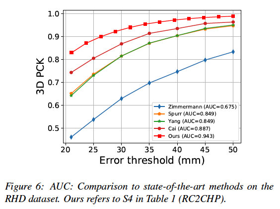

## Aligning Latent Spaces for 3D Hand Pose Estimation

monocular RGB 입력으로 부터 hand pose 를 추정하는 것은 어렵다. 

기존의 연구는 depth map 과 같은 다른 modality를 이용할 수 있음에도 불구 하고 오로지 RGB 정보만 사용한 monocular 환경에 대한 것이었다.

**이 논문에서는 RGB 를 기반으로 한 hand pose estimation을 개선하기 위해 다른 modality를 weak label로 이용한 joint latent representation 학습을 제안한다.**

**heat map, depth map** 그리고 **point cloud**와 같은 여러가지 modality를 embedding 했다.

특히, h<u>and surface의 point cloud를 encoding 하고 decoding하는 것은 joint latent representation의 품질을 향상 시킨다는 것을 알아 냈다.</u> 

### Introudction

hand pose estimation의 적용 분야

- human activity analysis
- human computer interaction
- robotics

Depth-based pose estimation은 딥러닝을 이용하면서 매우 정확해 졌다. depth 센서가 일반화 됐음에도 불구하고 고품질 depth map은 실내에서만 캡처할 수 있으므로 사용할 수 있는 환경이 제한된다. 게다가, 기존의 RGB 화면뿐만 아니라 단순한 RGB 카메라는 여전히 depth 카메라와 depth 데이터보다 훨씬 더 흔하다.

이와 같이 정확한 RGB 기반 3D hand pose estimation은 여전히 필요하며, 특히 monocular viewpoint로 볼 때 더 그러하다.

monocular RGB 입력과 관련된 모호성을 다루기 위해, 이전 작품들은 대량의 교육 데이터에 의존해왔다. 3D hand pose와 같은 정확한 ground truth label을 얻기란 매우 어렵기 때문에 데이터 세트 크기가 순전히 증가함에 따라 얻는 이득은 거의 없다.

3D hand joint position 을 정확하게 annotation하는 것은 어려운 작업이며, 종종 human annotator간에 합의가 거의 이루어지지 않는다.RGB 영상을 생성하기 위해 여러 가지 방법이 개발되었지만, 합성 데이터와 실제 데이터 사이에는 여전히 큰 도메인 간 차이가 존재하여 합성 데이터의 효용을 제한 되고 있다.

RGB 데이터에 대한 정확한 ground truth은 수집하기 어렵지만 label이 부착되지 않은 RGB-D hand드 데이터는 label 부착된 깊이 맵과 함께 활용할 수 있다.

이 논문에서는 RGB based hand pose estimation을 강화하기 위한 약한 라벨로서 multiple modality를 활용하는 것을 목표로 한다.

이 논문에서  다양한 hand data의 modality(<u>RGB image, depth map, point clouds, 3D pose, heat map 그리고 segmentation mask</u>) 를 고려 했고 cross-modal inference 문제로 RGB based hand pose estimation를 공식화 했다. 특히, **multi-modal VAE**를 제안했다.

이 논문에서는 3D pose, point cloud, heat map 등 세 가지 multiple modality에 대해 서로 다른 목표를 도출하고 관련된 hand latent spaces를 정렬하는 두 가지 방법을 보여준다. 

장점

1. 무엇보다도 먼저, 빠르게 수렴하여 잘 구조화된 잠적 공간을 만든다 . 이와 비교하여, multimodal shared latent space은 multiple modality에서 데이터를 추출할 때 변동하는 경향이 있다.
2. 정렬을 통한 학습 계획은 해당되지 않는 데이터와 weak supervision으로 작업하는 데 더 많은 유연성을 제공한다.

결과적인 latent representation은 monocular RGB 이미지로부터 모두 매우 정확한 hand pose를 추정하고 hand surface의 사실적인 point cloud를 합성 할 수 있다

#### contribution

- RGB based hand pose estimation을 multi-modal learning, cross modal inference로 공식화하고 다양한 modality의 다른 hand input으로부터 학습하기 위한 세 가지 전략 제안
-  latent hand space를 학습하기 위해 point-cloud 및 heat map과 같은 비 전통적인 입력을 탐구하고 RGB based ㅗhand pose estimation 시스템의 정확도를 향상시키기 위해 어떻게 활용할 수 있는지 보여준다. 프레임 워크의 부수적인 산출물은 RGB 이미지에서 실제처럼 보이는 포인트 클라우드를 합성 할 수 있다는 것이다.
- 공개적으로 사용 가능한 두 가지 벤치 마크로 평가하여 제안 된 프레임 워크가 훈련 중에 auxiliary modality를 최대한 활용하여 RGB pose estimation의 정확도를 높였다.
  까다로운 RHD 데이터셋에 대한 19%의 엄청난 향상을 포함하여 monocular RGB based hand pose estimation에서 우리의 estimated 포즈는 최신 방법을 능가한다.

### Related Works

hand pose estimation approach를 분류하는 한 가지 방법

- generative 
  - hand model를 employ 하고 hand model을 observation에 fit 하기 위해 optimization을 사용한다.
  - good initialization이 필요하며 그렇지 않으면 local minima에 빠질 수 있다.
- discriminative
  - visual observation을 hand pose에 직접 맵핑 하는 것을 학습 한다.
  - 대규모 annotated dataset로 인해, discriminative method를 기반으로 한 deep learning 이 매우 큰 성능을 낸다.

최근에 특히 depth나 3D 데이터를 입력으로 사용할 경우 더 정확하다. 그러나 3D 데이터는 training 혹은 testing시에 항상 available하지 않다.  몇몇 최근 작업은 monocular RGB data를 이용하기 시작했다. 가장 최근의 monocular RGB based 방법은 RGB 이미지로만 테스트를 수행하더라도 훈련을 위해 depth information을 활용한다.

### Methodology

**cross-modal method의 목적**

- 서로 다른 modality의 관계를 찾아 내는 것. 
- 어떤 다른 modality의 observation이 주어 졌을 때 target modality의 정보를 찾아 낼 수 있다.

cross modal VAE를 먼저 제시를 하고 multiple modality로 부터의 input과 output을 처리하기 위해 확장한다. 그리고 나서 두가지 latent space alignment operator strategy를 소개하고 이것을 RGB-based hand pose estimation에 적용하는 방법을 안내한다.

#### Cross Modal VAE and its extension

어떤 input modality로 부터 data sample x가 주어졌을 때, cross modal VAE는 latent variable z를 통해 evidence lower bound (ELBO)를 최대화 함으로써 target modality에서 coressponding target value y를 추정하는 것을 목표로 한다. 

$$
log\ p(y) \ge \text{ELBO}_\text{cVAE}(x;y;\theta,\phi)\qquad(1) \\= E_{z \sim q_\phi} log\ p_\theta (y|z) - \beta D_\text{KL}(q_\phi(z|x) ||p(z))
$$
여기서 $D_\text{KL} (\cdot) $ 는 Kullback-Leibler divergence, $\beta$ 는 latent space capacity와 reconstruction accuracy의 balence를 맞추기 위한 hyper parameter 다.

$p(z) = \mathcal{N}(0, \mathsf{I}) $ 은 latent variable $z$ 의 Gaussian prior 다. variational approximation $q_\theta (z|x) $ 는 $x$ 에서 $z$ 로의 encoder 이고 $p_\theta (y|z) $ 는 $z$에서 $y$로의 디코더 혹은 inference network 다.

<u>$x$ 와 $y$ 에 추가해서 $N$ 개의 다른 modality $\left\{w_1,\dots,w_N \right\}$ 로 부터 corresponding data가 있다고 가정하고 이런 modality는 latent representation $z$ 가 주어졌을 때 조건부 독립이라고 가정한다.</u>

 단순하게 설명하기 위해 $N=1$ 이라고 하자.

이 추가적인 modality를 encode 하기 위해서 식1에서 ELBO를 확장한다.

$$
log\ p(y,w_1) \ge \text{ELBO}_\text{cVAE}(x,w_1;y,w_1;\phi_{x,w_1},\theta_y,\theta_{w_1}) \\= E_{z \sim \phi_{x,w_1}} log\ p_{\theta_y} (y|z) + \lambda_{w_1}E_{z \sim \phi_{x,w_1}}log\ p_{\theta_{w_1}}(w_1|z) - \beta D_\text{KL}(q_{\phi_{x,w_1}}(z|x,w_1) ||p(z)) \qquad(2)
$$
여기서 $\lambda_{w_1}$ 는 $w1$ 과 $y$ 사이에서 reconstruction accuracy를 regulate하는 hyperparameter 다. 

original cross modal 과 더 많은 modality로 확장한 것에 대한 graphical model은 다음 <그림 2>에서 (a)와 (b)이다.

<식 2>의 variational approximation $q_\phi(z|x,w_1)$ 로 부터 sampling 된 $z$는 <식 1>에서 $q_\phi (z|x)$ 로 부터 sampling된 것보다 더 informative 하기를 기대한다. 게다가, decoder $p_{\theta_{w_1}} $ 에 대한 expectation term은 latent space 가 $y's$ modality에 over-fitting 되는 것을 막아 주기를 기대한다. 

(여기서 부터 $z$를 $z_\text{joint}$ 로 define한다.)

#### Latent Space Alignment

### Impementation Details

#### Data Pre-processing and Augmentation

### Experimentation

- the dimensionality of latent variable $z$ : 64
- $\lambda_\text{heat}$ : 0.01
- $\lambda_\text{cloud}$ : 1
- $\beta^{\prime}$  : 1
- Tensorflow 
- Adam optimizer (initial learning rate : $10^{-4}$ ) 
- learning rate는 수렴 후 10을 지수로 2배씩 낮춘다.
- batch size : 32
- $\beta$ : from $10^{-5}$ to $10^{-3}$

#### dataset and evaluation metrics

데이터 셋

- Rendered Hand Pose Dataset (RHD)
  - RHD는 39개의 동작을 수행하는 20명의 characters로부터 320×320 해상도인 렌더링된 손 이미지의 합성 데이터 세트
  - training : 41238개
  - testing : 2728개
  - 각 RGB 이미지에는 대응되는 depth map, segmentation mask 그리고 3D hand pose가 제공된다.
  - 이 데이터 세트는 다양한 시각적 풍경, 조명, 소음 때문에 매우 어렵다.
- Stereo Hand Pose Tracking Bechmark (STB)
  - 한 사람의 왼손이 여섯 개의 서로 다른 실제 배경 앞에 있는 비디오를 포함하고 있다.
  - 데이터 세트는 스테레오 이미지, 640 × 480 해상도의 color-depth pairs, 3D hand pose annotations 을 제공한다.
  - 데이터 세트의 12개 시퀀스 각각에 1500개의 프레임이 포함되어 있다. (10개는 train용 , 2개는 test용으로 사용함.)

metrics

- mean end-point-error (EPE)

  

- area under the curve (AUC) on the percentage of correct keypoints (PCK)

#### Qualitative results

some qualitative examples of poses and point clouds decoded from the $z_\text{rgb}$

#### RGB 3D Hand Pose Estimation

**Viewpoint correction**

**Comparison to state-of-the-art**

**Weakly-supervised learning**

- 제안된 방법의 flexibility로 인해 point cloud는 training을 도와주기 위해 unlabelled data에 대한 "weak" 라벨로 사용할 수 있다.
- 처음 m% 샘플은 라벨된 데이터로 사용하고 (RGB, point cloud 그리고 3D pos 포함) , 나머지는 unlabelled data로 사용(라벨링 때문에 3D pose는 사용하지 않음 )해서 테스트를 했다.

### 결론

- 이 논문에서는 RGB-based hand pose estimation을 multimodal 학습과 cross-modal inference로 formulate했다.

- 3가지 hand modality에 대해 각기 다른 목표를 도출하고 관련된 latent space를 하나로 합쳐서 하나로 정렬 하는 각기 다른 방법을 보여줬다.

  