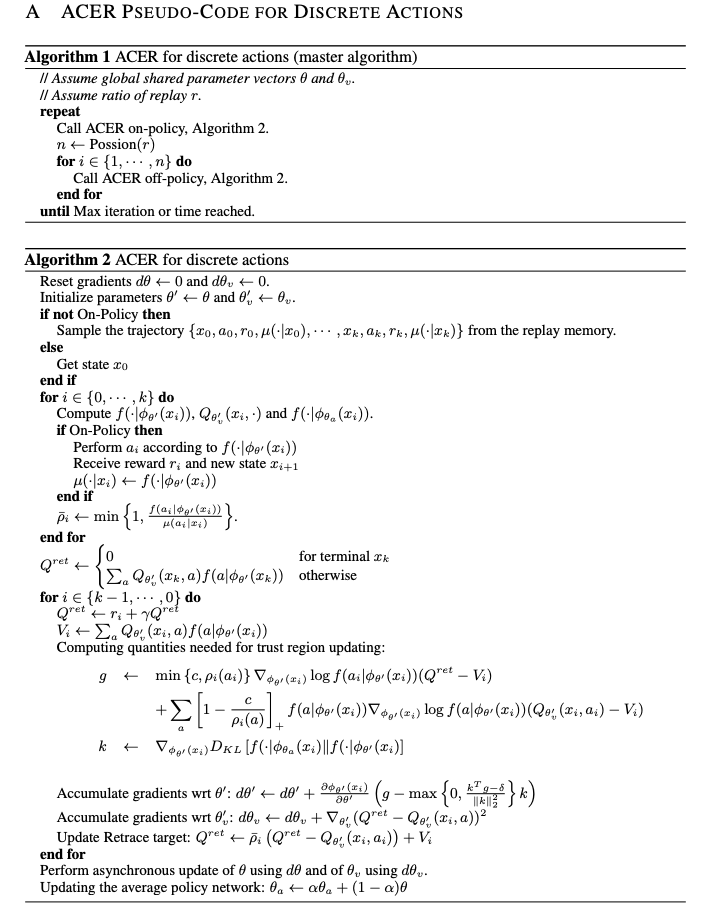
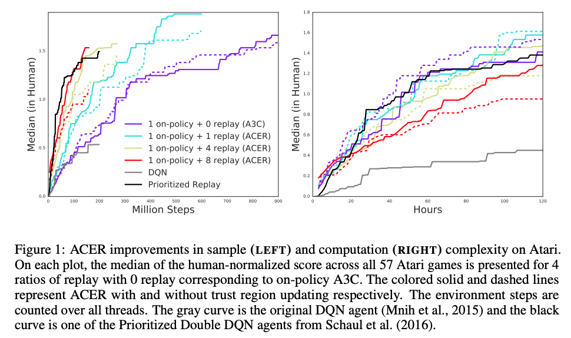
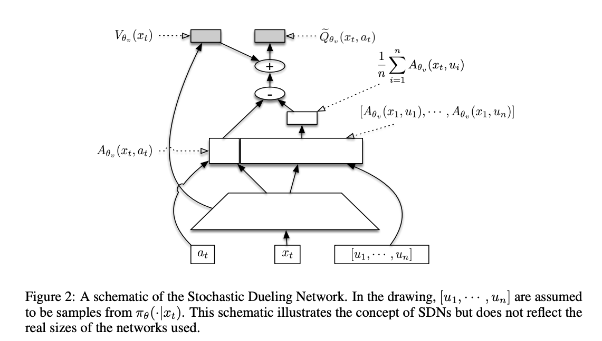
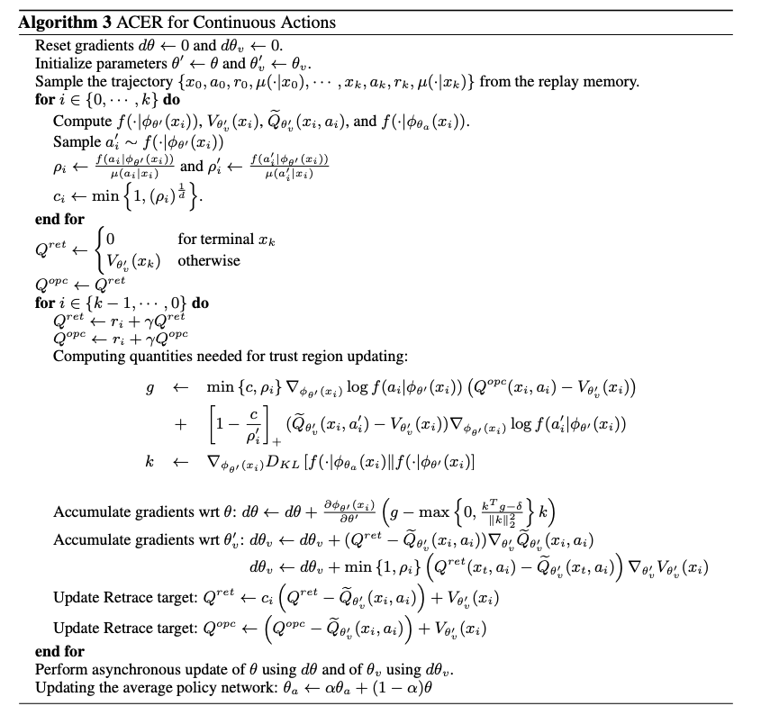
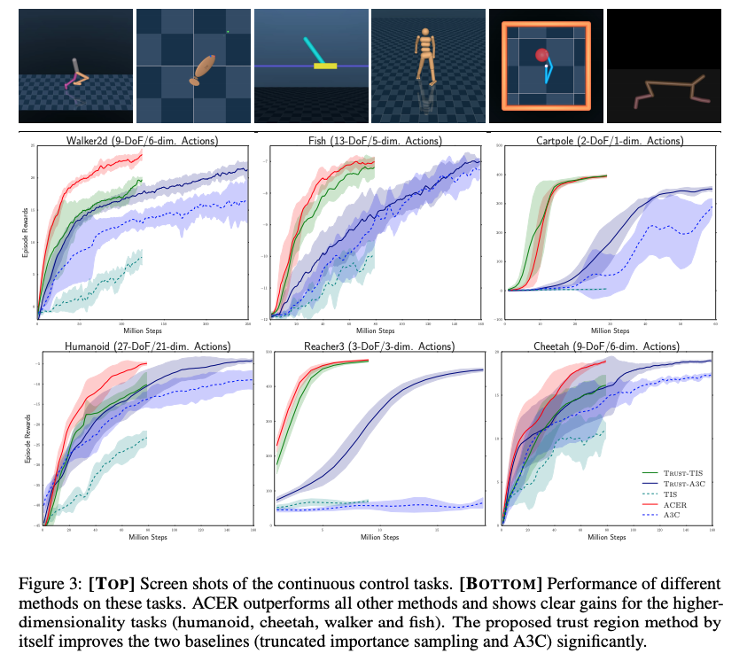

## SAMPLE EFFICIENT ACTOR-CRITIC WITH EXPERIENCE REPLAY

- 목적
  - stable
  - sample efficient
  
- 논문에서 제안한 여러가지 방법들
  - **truncated importance sampling with bias correction**
  - **stochastic dueling network architectures**
  - **a new trust region policy optimization method**

- Replay Buffer
  - DQN에서 처음 적용
  - sample correlation을 줄이기 위한 용도로 사용된 기술이지만, 실제로는 **sample efficiency**도 향상 시킨다

### Background and Prbolem Setup

Max. $R_t = \mathbb{E}(\sum_{i \ge 0} \gamma^i r_{r+i})$ 

$Q^{\pi} (x_t, a_t) = \mathbb{E}_{x_{t+1}:\infty}, a_{t+1:\infty} [R_t |x_t,a_t] \qquad \qquad V^\pi(x_t) = \mathbb{E}_{a_t}[Q^\pi (x_t,a_t)|x_t]$

$A^\pi (x_t,a_t) = Q^\pi (x_t,a_t)-V^\pi (x_t) \qquad \qquad \qquad \mathbb{E}_{a_t}[A^\pi (x_t,a_t)] = 0$ 

$g = \mathbb{E}_{x_0:\infty, a_0:\infty} [ \sum_{t \ge 0} A^\pi(x_t,a_t) \bigtriangledown_\theta log \pi_\theta (a_t|x_t)] \qquad \qquad (1)$

**A3C**

- trade-off bias and variance 

$$
\hat{g}^{\text{a3c}} = \sum_{t \ge 0} \left(\left(\sum_{i=0}^{k-1} \gamma^i r_{t+i})+\gamma^k V^{\pi}_{\theta_v}(x_{t+k})-V^{\pi}_{\theta_v}(x_{t}) \right)\right) \bigtriangledown_\theta log \pi_\theta (a_t|x_t) \qquad \qquad (2)
$$

**ACER** 

- A3C + serveral modification , new modules
- a single deep neural network to estimate the policy $\pi_\theta (a_t | x_t)$ and value function  $V^{\pi}_{\theta_v} (x_t)$

### Discrete Actor Critic With Experience Replay

**off-policy learning with experience replay**

- off-policy learning with experience replay은 actor-critics의 **sample efficiency 를 향상** 시킨다. 
- 그러나 **off-policy의 variance와 stability를 conotrol하는 것은 어려운 일**이다. 
- **Importance sampling**은 off-policy learning의 가장 popular한 approach이다.

$$
\hat{g}^{\text{imp}} = \left( \prod_{t=0}^K \rho_t \right) \sum^k_{t=0} \left( \sum^k_{i=0} \gamma^i r_{t+i}\right) \bigtriangledown_\theta log \pi_\theta (a_t|x_t) \qquad \qquad (3) \\ \rho_t = {\pi(a_t|x_t) \over {\mu (a_t|x_t)}} \qquad \qquad \qquad \qquad  \qquad \qquad \qquad \qquad \qquad \qquad
$$

- $\left( \prod_{t=0}^K \rho_t \right)$ 은 **high variance**를 야기한다.

gradient를 approxmiation 하기 위해 **marginal value functions over the limiting distribution ** 사용해서 해결.

$$
g^{\text{marg}} = \mathbb{E}_{x_t \sim \beta, a_t \sim \mu}[\rho_t \bigtriangledown_\theta log \pi_\theta (x_t|x_t)Q^\pi (x_t,a_t)] \qquad \qquad \qquad (4)
$$
limiting distribution $ \beta(x) = lim_{t \rarr \infty} p(x_t = x|x_0, \mu)$ with behavior policy $\mu$

극한분포는 <u>이산 또는 연속 시간 확률과정에서 시간이 무한대로 갈 때, 확률과정의 분포가 일정한 분포를 가지는 경우 이를 주어진 확률과정의 극한분포라고 한다.</u>

여기서 중요한 점  두가지.

1. $Q^u$ 대신에 $Q^\pi$ 를 사용했다.  따라서 $Q^\pi$ 를 추정해야 한다.
2. importance weight의 product 가 없고 marginal importance weight $\rho_t$ 를 추정할 필요가 있다.

Off-Policy Actor-Critic 논문에서는 $R^\lambda_t = r_t + (1-\lambda) \gamma V(x_{t+1}) + \lambda \gamma \rho_{t+1}R^\lambda_{t+1}$ 라는 재귀식을 통해 $Q^\pi$ 를 계산하는데 <u>$\rho_t$ 를 계속 곱해주기 때문에 학습이 불안정해 줄 수 있다.</u> 

#### Multi-Step Estimation of The State-Action Value Function

- 이 논문에서는 Retrace(Munos et al., 2016 [Safe and Efficient Off-Policy Reinforcement Learning](https://arxiv.org/abs/1606.02647)) 방법을 사용해서 $Q^\pi {x_t, a_t}$ 를 추정한다. ( $\rho$ 대신에 $\bar{\rho}$ 를 쓰는 것만으로도 variance가 낮아진다고 한다.)

$$
Q^{\text{ret}} (x_t,a_t) = r-t + \gamma \bar{\rho}_{t+1} [ Q^{\text{ret}}(x_{t+1},a_{t+1})-Q(x_{t+1},a_{t+1})] + \gamma V(x_{t+1}) \qquad \qquad  \qquad (5)
$$

$\bar{\rho}_t$ 는 **truncated importance weight** 라 한다. $\bar{\rho}_t = min \left\{c,\rho_t \right\}$

$Q$ 는 $Q^\pi$ 의 current value estimate 고 $V(x) = \mathbb{E}_{a \sim \pi} Q(x,a)$ 

- **Retrace**는 **low variance를 갖고 수렴이 보장된** **off-policy, return-based algorithm** 이다.

- $Q$ 를 계산 하기 위해  discrete action space인 경우 **"two heades"를 갖는 convolutional neural network** 적용했다. ( $Q_{\theta_v} (x_t, a_t)$ 와 $\pi_\theta (a_t|x_t)$ 를 동시에 추정하기 위해 ) 
- Retrace 는 multistep returns를 사용하기 때문에 ,  **bias를 줄인다**. 

- critic $Q_{\theta_v} (x_t, a_t)$ 를 학습하기 위해 $Q^{\text{ret}}(x_t,a_t)$ 를 target으로 MSE 를 사용했고 parameter $\theta_v$ 를 업데이트 하기 위해 다음과 같은 standard gradient를 사용했다.
  $$
  \left( Q^{\text{ret}}(x_t,a_t) - Q_{\theta_v} (x_t, a_t)\right ) \bigtriangledown_{\theta_v} Q_{\theta_v} (x_t,a_t) \qquad \qquad \qquad (6)
  $$
  

**The purpose of the multi-step estimator $Q^{\text{ret}}$** 

- <u>to reduce bias in the policy gradient</u>.
- <u>to enable faster learning of the critic , hence further reducing bias.</u>

#### Importance Weight Truncation with Bais Correction

- (식 4)에서 marginal importance weight는  커질 수 있어서, instability를 야기한다. 즉 식 (3)에서 식 (4)로 넘어오며 importance weight에 대한 곱셉항을 제거했지만, $\rho_t$ 가 **unbounded라는 사실은 변함이 없기 때문에 여전히 학습이 불안정해질 수 있는 요소**가 남아 있다.

- hight variance에 대해 safe-guard를 하기위해 

  - importance weight를 truncate하고 다음과 같이 $g^{\text{marg}}$ 를 correction term을 도입해서 나눠준다.

  

$$
g^{\text{marg}} = \mathbb{E}_{x_t , a_t}[\rho_t \bigtriangledown_\theta log \pi_\theta (x_t|x_t)Q^\pi (x_t,a_t)] \qquad \qquad \qquad \qquad \qquad \qquad \qquad \qquad \qquad \qquad\qquad \qquad \qquad \qquad \qquad\\
= \mathbb{E}_{x_t} \left [ \mathbb{E}_{a_t} [ \bar{\rho}_t \bigtriangledown_\theta log \pi_\theta (x_t|x_t)Q^\pi (x_t,a_t)] + \mathbb{E}_{a \sim \pi} \left( \left[ {\rho_t(a)-c} \over {\rho_t(a)}\right]_+ \bigtriangledown_\theta log \pi_\theta (x_t|x_t)Q^\pi (x_t,a)\right) \right] \qquad (7)
$$

- (수식 7)의 앞의 부분은 the **importance weight 를 clipping** 하여 gradient estimate 의 variance가 bound되게 한다.
- (수식 7)의 뒷 부분 correction term은 $\rho_t (a) > c$ 일 때 active된다.

corret term 의 $Q^\pi (x_t,a)$ 은 neural network approximation $Q_{\theta_v} (x_t,a)$ 로 모델링 한다. 

**Truncation with bias correction trick**

- variance를 줄여 주기 위해 advantage 사용

$$
\bar{g}^{\text{marg}} = \mathbb{E}_{x_t} \left [ \mathbb{E}_{a_t} [ \bar{\rho}_t \bigtriangledown_\theta log \pi_\theta (x_t|x_t)Q^{\text{ret}} (x_t,a_t)] + \mathbb{E}_{a \sim \pi} \left( \left[ {\rho_t(a)-c} \over {\rho_t(a)}\right]_+ \bigtriangledown_\theta log \pi_\theta (x_t|x_t)Q_{\theta_v} (x_t,a)\right) \right] \quad (8)
$$

(식 8)은 Markov process의 statioary distribution에 대해 expection을 포함하고 있는데 이것은 sampling trajectories로 approximation할 수 있다. 

$$
\hat{g}^{\text{acer}} = \bar{\rho}_t \bigtriangledown_\theta log \pi_\theta (x_t|x_t)[Q^{\text{ret}} (x_t,a_t) - V_{\theta_v}(x_t)] \qquad \qquad \qquad \qquad \qquad \qquad \qquad \\+ \mathbb{E}_{a \sim \pi} \left( \left[ {\rho_t(a)-c} \over {\rho_t(a)}\right]_+ \bigtriangledown_\theta log \pi_\theta (x_t|x_t)[Q_{\theta_v} (x_t,a) - V_{\theta_v}(x_t)] \right)  \quad (9)
$$

#### Efficient Trust Region Policy Opimization

- The policy updates of actor-critic methods do often **exhibit high variance**
- To ensure stability, we must **limit the per-step changes to the policy**.

- **TRPO**
  -  requires repeated computation of Fisher-vector products for each update. (prohibitively expensive in large domains)

  

- **average policy network**
  - a **running average of past policies** .
  - forces the updated policy **to not deviate far from this average**.

- policy network를 distribution $f$ 와 이 distribution의 statistics $\phi _\theta (x)$ 를 generate 하는 deep neural network 로 나눈다.  즉  $f$ 가 주어지면 policy는 $\phi_\theta : \pi(\cdot |x) = f( \cdot | \phi_\theta (x))$ 에 의해 characterized 된다. 
  - 예) $f$ 는 statistics로 probability vector $\phi_\theta(x)$ 를 갖는  categorical distribution으로 선택할 수 있다.
    
- $\theta : \theta_a \larr \alpha \theta_a + (1-\alpha) \theta$ 
  

$$
\hat{g}^{\text{acer}} = \bar{\rho}_t \bigtriangledown_{\phi_\theta (x_t)} log f (a_t|\phi_{\theta_t}(x))[Q^{\text{ret}} (x_t,a_t) - V_{\theta_v}(x_t)] \qquad \qquad \qquad \qquad \qquad \qquad \qquad \\+ \mathbb{E}_{a \sim \pi} \left( \left[ {\rho_t(a)-c} \over {\rho_t(a)}\right]_+ \bigtriangledown_{\phi_\theta (x_t)} log f (a_t|\phi_{\theta_t}(x))[Q_{\theta_v} (x_t,a) - V_{\theta_v}(x_t)] \right)  \quad (10)
$$

- averated policy network 가 있을 때, 제안된 trust region 업데이트는 두 단계를 거친다. 

  - 선형화된 KL divergence 제약식을 갖는 optimization 문제를 푼다
    
    
    $$
    \underset{z} {\text{minimize}} \quad  {1 \over 2} || \hat{g}^{\text{acer}} -z || ^2_2 \qquad \qquad \qquad \qquad \qquad \qquad \qquad \qquad\\
    \text{subject to }\quad \bigtriangledown_{\phi_\theta (x_t)}D_{\text{KL}}[f( \cdot|\theta_a (x_t))||f(\cdot|\phi_\theta (x_t))]^Tz \le \delta \qquad (11)
$$
    
    
    
  - 제약식이 선현이기 때문에, overall optimization problem 은 simple quadratic programming problem으로 reduce 할 있는데, 이것의 solution은 KKT codition을 사용한 closed 형태로 쉽게 derived할 수 있다.
    $$
    z^* = \hat{g}_t^\text{acer} - \text{max} \left \{ 0 , {{k^T \hat{g}_t^\text{acer} - \delta} \over {||k||^2_2}} \right\}k \qquad \qquad (12)
    $$
    

#### ACER Pseudo-Code for Discrete Actions

#### RESULTS ON ATARI

### Continuous Actor Critic with Experience Replay

#### Policy Evaluation

- <u>Retrace는</u> $Q_{\theta_v}$ 를 학습하기 위한 target를 제시하지만 $V_{\theta_v}$ 에 대해서는 target를 제시하지 않는다.

- $Q_{\theta_v}$ 가 주어졌을 때 $V_{\theta_v}$ 를 계산하기 위해서 importance sampling을 사용하지만 이 추정치는 **high variacne**를 갖는다. 

- **Stochastic Dueling Networks(SDN)** 

  -  $V^\pi$ 와 $Q^\pi$ off-policy을 추정하기 위해 사용된  Dueling network 에 영감을 받음.

  - 매 time step 마다 SDN은 $Q^\pi$ 에 대해 $\tilde{Q}_{\theta_v}$ 로 **stochastic 추정**하고 , $V^\pi$ 에 대해 $V_{\theta_v}$  **deterministic 추정**한다.   
    $$
    \tilde{Q}_{\theta_v} (x_t,a_t) \sim V_{\theta_v} (x_t) + A_{\theta_v}(x_t,a_t) - {1 \over n} \sum ^n_{i=1} A_{\theta_v} (x_t, u_i), \quad \text {and} \quad u_i \sim \pi_\theta ( \cdot|x_t) \qquad \qquad (13)
    $$
    여기서 $n$ 은 parameter 다. 

    
  -  $\mathbb{E}_{a \sim \pi (\cdot|x_t)} \left[ \mathbb{E}_{u_1:n \sim \pi(\cdot|x_t)} \left( \tilde{Q}_{\theta_v} (x_t,a_t)\right) \right] = V_{\theta_v}(x_t)$

     

  - $\tilde{Q}_{\theta_v}$ 를 학습함 으로써 $V^\pi$ 에 대해 학습할 수 있다. $Q^\pi$ 를   $\mathbb{E}_{u_1:n \sim \pi(\cdot|x_t)} \left( \tilde{Q}_{\theta_v} (x_t,a_t)\right) = Q^\pi (x_t, a_t)$ 과 같이 완벽하게 학습했다고 가정하면 $V_{\theta_v}(x_t) = \mathbb{E}_{a \sim \pi (\cdot|x_t)} \left[ \mathbb{E}_{u_1:n \sim \pi(\cdot|x_t)} \left( \tilde{Q}_{\theta_v} (x_t,a_t)\right) \right] = \mathbb{E}_{a \sim \pi (\cdot|x_t)} \left[ Q^\pi (x_t, a_t)\right] = V^\pi(x_t)$

     

  - 그래서 $\tilde{Q}_{\theta_v} (x_t,a_t)$ 에 대한 taget은 $V_{\theta_v}$ 를 업데이트에 할 때  오류가 같이 전파된다. 

    

     

- SDN에 덧붙여서 $V^\pi$ 를 추정하기 위해 다음과 같은 novel target을 만들었다.
  $$
  V^{\text{target}} (x_t) = \text{min} \left\{ 1, {{\pi(a_t|x_t)} \over {\mu (a_t|x_t)}}\right\} \left(Q^{\text{ret}}(x_t,a_t) - Q_{\theta_v} (x_t, a_t) \right) + V_{\theta_v}(x_t) \qquad \qquad (14)
  $$

- 마지막으로 continuous domain 에서 $Q^{\text{ret}}$ 를 추정하기 위해, 조금 다른 truncated importance weights $\bar{\rho}_t = \text{min} \left\{ 1, \left({{\pi(a_t|x_t)} \over {\mu (a_t|x_t)} } \right)^{1 \over d}\right\}$ 여기서 $d$ 는 action space의 dimensionality이다. 

#### Trust Region Updating

- continuous action space에서  $g^{\text{acer}}_t$ 를 유도하기 위해 sotchastic dueling network에 대해 ACER policy gradient를 고려해 보자. $\phi$ 에 대해서 
  $$
  g^{\text{acer}}_t = \mathbb{E}_{x_t} \left[ \mathbb{E}_{a_t} \left[ \bar{\rho_t} \bigtriangledown_{\phi_{\theta (x_t)}} log f(a_t|\phi_\theta(x_t))(Q^{\text{opc}}(x_t,a_t)-V_{\theta_v}(x_t)) \right] \qquad \qquad \qquad \qquad \qquad \qquad  \\
  + \underset{a \sim \pi} {\mathbb{E}} \left( \left[ {{\rho_t(a)-c} \over {\rho_t(a)}} \right]_+ (\tilde{Q}_{\theta_v}(x_t,a)-V_{\theta_v}(x_t)) \bigtriangledown_{\phi_\theta (x_t)} log f(a|\phi_\theta (x_t))\right) \right] \qquad \qquad (15)
  $$
  
-  (식 15)에서는 $Q^{\text{ret}}$ 대신에 $Q^{\text{opc}}$ 를 사용했다.

- $Q^{\text{opc}}$ 는 truncated importance ratio를 1로 대체 한다는 것을 제외하고는 Retrace 와 같다. (Appendix B 참조)

-  Observation $x_t$ 가 주어졌을 때 다음과 같은 Monte Carlo approximation을 얻기 위해 $a^{'}_t \sim \pi_\theta ( \cdot|x_t)$ 로 샘플링을 한다. 
  $$
  \hat{g}^{\text{acer}}_t =  \bar{\rho_t} \bigtriangledown_{\phi_{\theta (x_t)}} log f(a_t|\phi_\theta(x_t))(Q^{\text{opc}}(x_t,a_t)-V_{\theta_v}(x_t))  \qquad \qquad \qquad \qquad \qquad \qquad  \\
  + \left[ {{\rho_t(a^{'}_t)-c} \over {\rho_t(a^{'}_t)}} \right]_+ (\tilde{Q}_{\theta_v}(x_t,a^{'}_t)-V_{\theta_v}(x_t)) \bigtriangledown_{\phi_\theta (x_t)} log f(a^{'}_t|\phi_\theta (x_t))\qquad \qquad (16)
  $$
  
- $f$ 와 $\hat{g}^{\text{acer}}_t$ 가 주어 졌을 때 update를 완성하기 위해 "Discrete Actor Criti With Experience Replay - Efficient Trust Region Policy Opimization"에서 설명한 step을 따른다. 

#### $Q(\lambda)$ with Off-Policy Correctoins

$$
Q^{\text{opc}} (x_t, a_t) = r_t + \gamma \left[ Q^{\text{opc}} (x_{t+1}, a_{t+1}) - Q(x_{t+1}, a_{t+1}) \right] + \gamma V(x_{t+1}) \qquad \qquad (21)
$$

#### Algorithm ACER for Continuous Actions

#### Reulsts on MuJoCo

### Theoretical Analysis

-  Retrace 가 이 논문에서 진전된 an application of the importance weight truncation와  bias correction trick  로 해석될 수 있음을 증명한다. 
- 다음 수식을 고려해 보자

$$
Q^\pi (x_t, a_t) = \mathbb{E}_{x_{t+1}a_{t+1}} [r_t+ \gamma \rho _{t+1} Q^\pi (x_{t+1},a_{t+1})] \qquad \qquad (17)
$$

- (식 17)을 얻기 위해 weight truncation 과 bias correction을 적용한다면

$$
Q^\pi (x_t,a_t) = \mathbb{E}_{x_{t+1} a_{t+1}} \left[ r_t + \gamma \rho_{t+1} Q^{\pi} (x_{t+1}, a_{t+1}) + \gamma \underset {a \sim \pi} {\mathbb{E}} \left( \left[ {{\rho_{t+1}(a)-c} \over{ \rho_{t+1}}(a) }\right]_+ Q^{\pi} (x_{t+1},a) \right)\right] \qquad(18)
$$

- (식 18) 에서 $Q^\pi$ 를 recursively 하게 expanding 함으로써  $Q^\pi (x,a)$ 는 다음과 같다.
  $$
  Q^\pi (x,a) = \mathbb{E}_{\mu} \left[ \sum_{t \ge 0 } \gamma^t \left( \prod_{i=1}^t \bar{\rho}_i\right) \left( r_t + \gamma \underset{b \sim \pi}{\mathbb{E}} \left( \left[ {{\rho_{t+1}(b)-c} \over {\rho_{t+1}(b)}}\right]_+ Q^\pi(x_{t+1} , b)\right) \right)\right] \qquad \qquad (19)
  $$
  
- expectation $\mathbb{E}_\mu$ 는 $\mu$ 로 generate 한 actions을 취하는  $x$ 에서 시작하는 trajectories에 취한다. 
- $Q^\pi$ 를 사용할 수 없을 때, current estimate $Q$ 로 대체한다. 

$$
\mathcal{B}Q (x,a) = \mathbb{E}_{\mu} \left[ \sum_{t \ge 0 } \gamma^t \left( \prod_{i=1}^t \bar{\rho}_i\right) \left( r_t + \gamma \underset{b \sim \pi}{\mathbb{E}} \left( \left[ {{\rho_{t+1}(b)-c} \over {\rho_{t+1}(b)}}\right]_+ Q(x_{t+1} , b)\right) \right)\right] \qquad \qquad (20)
$$

- 다음 명제는 $\mathcal{B}$ 이 unique fiexe point $Q^{\pi}$ 로 contraction operator 라는 것을 보여준다.

**Proposition 1**. The operator B is a contraction operator such that $||\mathcal{B}Q − Q^\pi||_{\infty} ≤ \gamma ||Q − Q^\pi||_\infty$ and $\mathcal{B}$ is equivalent to Retrace.

(Appendix C)

- Finally, $\mathcal{B}$ , and therefore Retrace, generalizes both the Bellman operator $\mathcal{T}^\pi $ and importance sampling.
- Specifically, when $c = 0$,  $\mathcal{B} = \mathcal{T}^\pi $ and when $c = \infty$, $\mathcal{B}$  recovers importance sampling(Appendix C).

### Concluding Remarks

- continuous 과 discrete action spaces로 확장한 **a stable off-policy actor critic** 소개

- 다음 기법 사용

  - **truncated importance sampling with bias correction**
  - **stochastic dueling network architectures**
  - **a new trust region policy optimization method**

  