

### 8.2.3 가우시안 LQR

- 확률적 LQR의 확정적 정책을 $\pi(u_t|x_t) = N(x_t|\mu_t,S_t)$ 와 같은 확률밀도 함수를 갖는 확률적 정책으로 확장 시킨 것

- 동일한 $x_t$ 에 대해 다른 제어 $\mu_t$ 가 선택될 수 있다.

- 목적함수
  $$
  J_0 = E_{\tau \sim p(\tau)}\left[ \sum^T_{t=0}(c(x_t,u_t)+log\ \pi(u_t|x_t)) \right]
  $$
  

위의 식을 전개 하면 

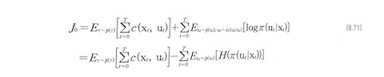

$$
H(\pi(u_t|x_t)) = -\int \pi(u_t|x_t) log\ \pi(u_t|x_t) du_t
$$

확률적 LQR의 목적함수에 **한계확률밀도함수 $p(x_t)$ 에 대한 정책 엔트로피 기대값 도입됨**

기존 목적함수에 화률적 정책의 엔트로피가 추가함으로써 가우시안 LQR 제어기는 **비용을 최소화함과 동시에 정책의 무작위성을 최대화** 하는 특성이 있다.

확률적 시스템에서는 상태 변수가 랜덤 변수. $\rightarrow$ 시간스텝 $t$ 에서의 제어는 상태변수 $x_t$ 를 기반으로 구축해야 한다는 추가 조건 필요 $\rightarrow$ 목적함수를 다음과 같이 초기 상태변수 $x_0$ 에 대한 조건부 함수로 바꾼다.

$$
V(x_0) = E_{\tau_{u_0}\sim p(\tau_{u_0}|x_0)} \left[ \sum^T_{t=0} (c(x_t,u_t)+log\ \pi(u_t|x_t)) \right]
$$

새로운 목적함수는 상태가치 함수에 엔트로피를 추가한 것이므로 **소프트 상태가치 함수(soft state-value function)**이라 부른다.

원래 목적함수와 소프트 상태가치 함수와의 관계
$$
J_0 = E_{x_0 \sim p(x_0)} [V(x_0)]
$$
DP를 적용하기 위해 소프트 상태가치 함수를 시간스텝 t를 기준으로 전개 해 보자. (식 8.75)

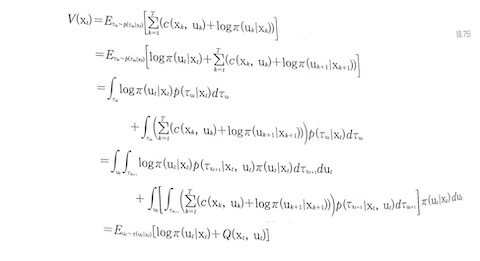

여기서 $\tau_{u_t} = (u_t, x_{t+1}, u_{t+1},...,x_T,u_T)$ , $\tau_{x_{t+1}} = (x_{t+1}, u_{t+1},...,x_T,u_T)$ 다. 정리를 하면,
$$
V(x_t) = E_{u_t \sim \pi(u_t|x_t)}[log\ \pi(u_t|x_t)+Q(x_t,u_t)]
$$
$Q(x_t,u_t)$ : **소프트 행동가치 함수**

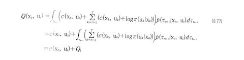

$Q$ 를 정리해 보면,

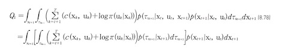

대괄호는 $V(x_{t+1})$ 이므로
$$
Q_1 = \int_{x_{t+1}} V(x_{t+1})p(x_{t+1}|x_t,u_t) dx_{t+1}
$$
따라서 소프트 행동가치 함수는 다음과 같이 된다.

위의 식을  식(8.75)에 대입하면 다음과 같다.
$$
V(x_t) = E_{u_t \sim \pi(u_t|x_t)} \left[ log\ \pi(u_t|x_t)+ c(x_t, u_t)+E_{u_{t+1} \sim p(x_{t+1}|x_t,u_t)} \left[ V(x_{t+1}) \right] \right]
$$
벨만의 최적성 원리에 의하면 현재 시간 스텝 $t$ 에서 최종 시간스텝 $T$ 까지 최소의 비용함수를 실현 하는 현재 시간스텝 $t$ 의 최적제어는 다음 식을 만족해야 하다.

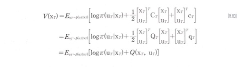

여기서 $Q_T=C_T$ , $q_T = c_T$ 로 놓았다. 최적정책을 가우시안 확률민도 함수로 가정했으므로 소프트 상태 가치 함수는 다음과 같이 전개 된다.

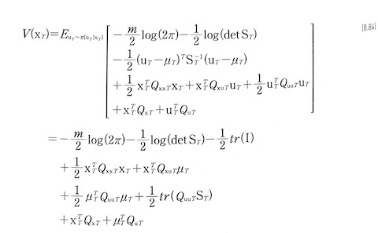

여기서 $m$ 은 $u_T$ 의 차원이고 $I$ 는 단위행렬이며
$$
Q_T = \begin{bmatrix}
Q_{xxT} & Q_{xuT} \\
Q_{uxT} & Q_{uuT}
\end{bmatrix} \\
q_T = \begin{bmatrix}
Q_{xT} \\
Q_{uT}
\end{bmatrix}
$$
소프트 상태가치 함수를 최소로 만드는 최적 정책은 다음과 같이 가우시안 분포의 평균과 공분산에 대해서 각각 미분하여 구할 수 있다.

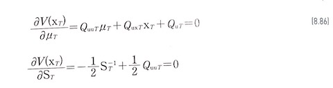

그러면 $\mu^*_T$ 와 $S^*_T$ 는 다음과 같이 구해진다.

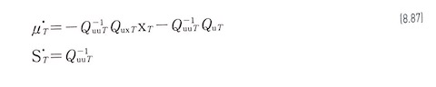

칼만 게인을 다음과 같이 정의를 하면

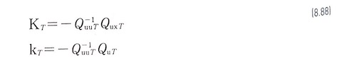

t=T에서의 최적 가우시안 LQR의 평균제어는 다음과 같이 쓸 수 있다.
$$
\mu^*_T = K_Tx_T+k_T
$$
위 식을 이용해 $t=T$에서의 최소 소프트 상태가치 값을 구하면 다음과 같다.

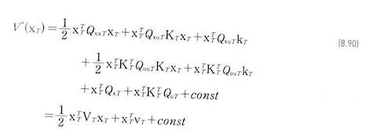

여기서

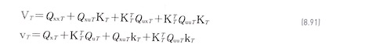

다음으로 시간의 다음 역방향 단계인 $t=T-1$  에서는 소프트 상태가치 함수가 다음과 같다.

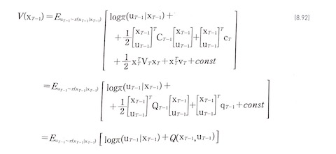

여기서
$$
Q_{T-1} = C_{T-1} +F^T_{T-1} V_T F_{T-1} \qquad\quad\quad\\
q_{T-1} = c_{T-1} +F^T_{T-1} V_T F_{T-1}+F^T_{T-1}v_T
$$
최적정책이 가우시안 확률밀도 함수이므로 소프트 상태가치 함수는 다음과 같이 전개된다.

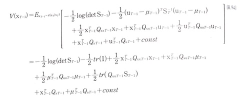

여기서
$$
Q_{T-1} = \begin{bmatrix}
Q_{xxT-1} & Q_{xuT-1} \\
Q_{uxT-1} & Q_{uuT-1}
\end{bmatrix} \\
q_{T-1} = \begin{bmatrix}
Q_{xT-1} \\
Q_{uT-1}
\end{bmatrix}
$$
평균과 공분산에 대해서 각각 미분하여 계산하면

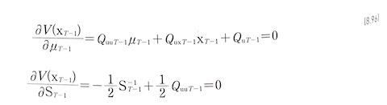

그러면 $\mu^*_{T-1}$ 와 $S^*_{T-1}$ 는 다음과 같이 구해진다.

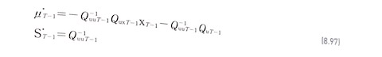

칼만 게인을 다음과 같이 정의를 하면

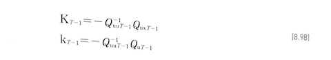

t=T-1에서의 최적 가우시안 LQR의 평균제어는 다음과 같이 쓸 수 있다.
$$
\mu^*_{T-1} = K_{T-1}x_{T-1}+k_{T-1}
$$
위의 식을 이용해 $t=T-1$ 에서의 최소 소프트 상태가치 값을 구하면 다음과 같다.

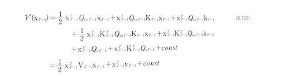

여기서

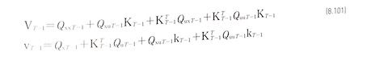

위의 전개식을 확정적  LQR과 비교를 해보면

- 가우시안 정책이 산출하는 평균은 확정적 LQR의 제어값과 동일하고

- 공분산은 $S_t = Q^-1_{uut}$ 임을 알수 있다.
  $$
  \pi(u_t|x_t) = N(K_tx_t + k_t, Q^-1_uut)
  $$
  

### 8.2.4 반복적 LQR (iLQR)

- 비선형 시스템에 LQR를 적용한 것

- LQR은 선형 시스템과 2차 함수로 된 비용함수에만 적용할 수 있다.

- iLQR은 현재의 궤적을 기준으로 비선형 시스템을 1차 시스템으로 근사하고 비용함수를 2차 함수로 근사한 후에 LQR을 적용하는 방법

- 궤적이 수렴할 때 까지 반복한다.

  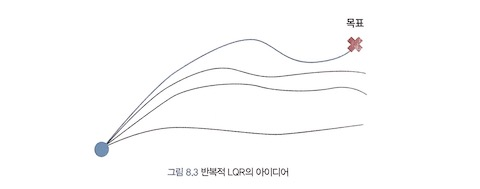

다음과 같은 비선형 이산시간 시스템을 생각해 보자

$x_{t+1} = f(x_t, u_t)$

다음과 같은 목적 함수를 가정한다.

$J_0 = \sum ^T _ {t=0} c(x_t, u_t)$

테일러 시리즈를 이용해 명목(norminal) 궤적 $( \hat{x_t}, \hat{u_t})$ 를 기준으로 비선형 시스템을 선형화해 보자
$$
x_{t+1} = f(x_t,u_t) \quad\quad\quad\quad\quad\quad\quad\quad\quad\quad\quad\quad\quad\quad\quad\quad\\ \approx f(\hat{x_t}, \hat{u_t}) + f_{x_t}(x_t-\hat{x_t}) + f_{u_t}(u_t-\hat{u_t}) \quad\\=f_{x_t}x_t+f_{u_t}u_t+f(\hat{x_t},\hat{u_t})-f_{x_t}\hat{x_t}-f_{u_t}\hat{u_t} \\=f_{x_t}x_t+f_{u_t}+f_{c_t}\quad\quad\quad\quad\quad\quad\quad\quad\quad\quad
$$

여기서 $f_{x_t} = \bigtriangledown_{x_t}f(\hat{x_t},\hat{u_t}),\qquad f_{u_t} = \bigtriangledown_{u_t}f(\hat{x_t},\hat{u_t}),\qquad f_{c_t} = f(\hat{x_t},\hat{u_t})-f_{x_t}\hat{x_t}-f_{u_t}\hat{u_t} $ 이다.

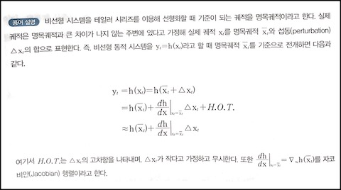

비용함수도 2차함수로 근사해보자.

여기서 

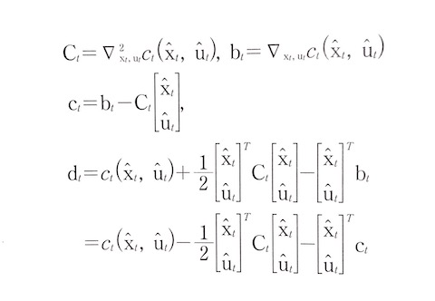

$d_t$ 는 상수 항으로서 2차 함수로 근사된 목적함수의 최적화에 영향을 미치지 않는다.

이제 선형화된 시스템과 2차 함수로 근사된 목적함수에 LQR 알고리즘을 적용할 수 있다.

- LQR의 역방향 패스를 적용하면 칼반 게인 시퀀스 $(K_0,K_1, ..., K_T)$ 와 $(k_0,k_1, ..., k_T)$ 를 계산할 수 있다. 

- 그런 다음, 순방향 패스를 계산하면 새로운  최적 제어 $(u_0,u_1, ... ,u_t)$ 와 같은 상태 시퀀스 $(x_0,x_1, ...,x_T)$ 를 얻을 수 있다.

- 그리고 명목 제어 시퀀스와 상태 시퀀스를 다음과 같이 업데이트 한 후, 위 과정을 수렴할 때 까지 반복하면 된다.
  $$
  (\hat{u_0},\hat{u_1},...,\hat{u_T}) \leftarrow (u_0,u_1,...,u_T) \\
  (\hat{x_0},\hat{x_1},...,\hat{x_T}) \leftarrow (x_0,x_1,...,x_T)
  $$
  

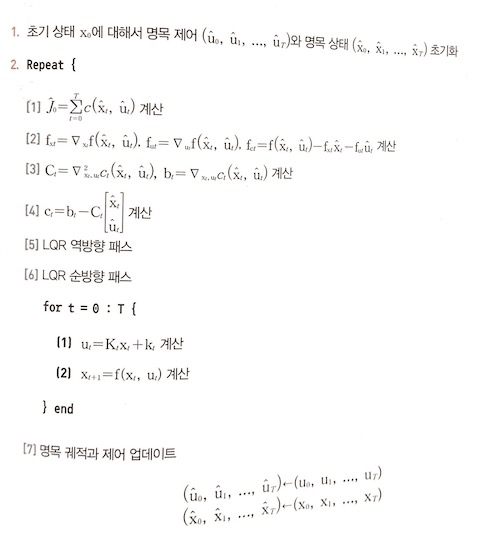

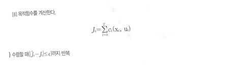

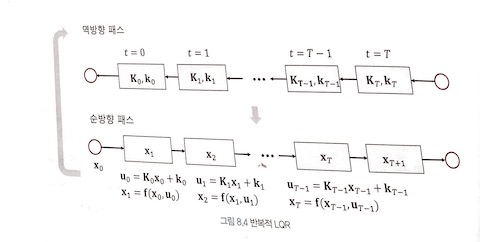

## 8.3 모델 학습 방법

모델 강화 학습에서는 에이전트 환경과 상호 작용 하면서 얻은 샘플로 시스템의 동역학 모델을 지도학습 한다.

가장 간단한 알고리즘

1. 랜덤 정책이나 기본 정책을 실행해 상태천이 데이터세트 $D=\{(X_t,u_t, x_{t+1})_j\}$ 를 수집한다.
2. $x_{t+1} \approx f(x_t , u _t)$ 가 되도록 함수 $f(x_t,u_t)$ 를 학습한다.
3. 동역학 모델을 이용해 정책을 계산한다.

- 시스템의 동역하 구조는 알지만 일부 파라미터 값이 불확실한 경우에 유용
- <u>데이터를 수집하는 데 사용한 정책과 추정된 모델을 이용해 계산하는 정책이 다르다.</u> 

이 책에서 사용할 모델 학습 방법

1. 랜덤 정책이나 기본 정책을 실행해 상태천이 데이터세트 $D=\{(X_t,u_t, x_{t+1})_j\}$ 를 수집한다.
2. $x_{t+1} \approx f(x_t , u _t)$ 가 되도록 함수 $f(x_t,u_t)$ 를 학습한다.
3. 동역학 모델을 이용해 정책을 계산한다.
4. 계산된 정책을 실행해 새로운 궤적을 발생시키고 상태 천이 데이터세트 D에 추가한다.
5. 2번으로 돌아가 절차를 반복한다.

시스템의 동역학 모델 $x_{t+1} \approx f(x_t, u_t)$ 를 사용할 수 있지만, 가우시안 프로세스, 가우시안 혼합모델 (GMM), **신경망**과 같은 일반적인 모델로도 표현할 수 있다.

글로벌 모델

- 모든 상태 공간에서 작동하는 단일 모델
- 상태 공간 전체에서 연속성을 갖고 있다는 장점이 있다.
- **시스템의 운동이 매우 복잡하다면** 전체 상태 공간에서 매우 복잡한 운동 모델을 고려해야 하고, 이 모델을 학습하기 위해서는 **많은 데이터**가 필요할 것이다.
- 가우시안 프로세스나 신경망 등으로 모델링

로컬 모델

- 상태 공간 일부에서만 작동하는 모델
- 단순하기 때문에 적은 수의 데이터세트 만으로도 추정하기 쉽다는 장점이 있다.
- 로컬 모델 기반으로 계산한 정책이 업데이트가 되면 해당 모델이 부정확해진다는 단점이 있다. $\rightarrow$ 명목 궤적 근처에서만 국지적으로 유효하기 때문
- 이 단점을 극복한다면 로컬 모델은 모델 기반 강화학습 기법을 실제 문제에 적용하는데 있어서 매우 유용한 수단이 될 수 있다.