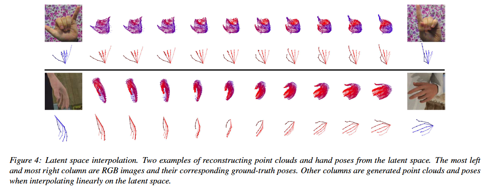

## Aligning Latent Spaces for 3D Hand Pose Estimation

### 배경

#### Hand pose estimation의 적용 분야 

- Human activity analysis
- Human computer interaction
- Robotics

#### One way to categorize hand pose estimation approaches

- **Generative**
  - Hand model를 사용
  - Observation에 fit 하기 위해 optimization 사용
  - 초기화를 잘하지 않으면 local minimum에 빠질 수 있음 
- **Discriminative**
  - 시각적인 observation을 hand pose에 맵핑 하는 것을 학습
  - 대규모 annotated dataset과 deep learning으로 매우 좋은 성능을 낸다.
  - 최근에는 depth 나 3D data를 사용함으로써 정확도가 향상됨

#### 문제점

- Depth camera나 3D 카메라의 여러 가지 제약 사항으로 Monocular RGB data를 이용하기 시작함.
- 여전히 RGB 데이터가 많음
- 기존 연구에서는 depth map과 같은 **다른** **modality를 이용할 수 있음에도 불구**하고, 오로지 RGB 정보만 사용

------

### Contribution

- We formulate RGB-based hand pose estimation **as a multi-modal learning, cross-modal inference problem** and **propose three strategies for learning from different hand inputs of various modalities**.
- We explore non-conventional inputs such as point clouds and heat maps for learning the latent hand space and **show how they can be leveraged for improving the accuracy of an RGB-based hand pose estimation system**. A side product of our framework is that we can synthesize realistic-looking point clouds of the hand from RGB images.
- By evaluating on two publicly available benchmarks, we show that our proposed framework makes full use of auxiliary modalities during training and boosts the accuracy of RGB pose estimates. Our estimated poses surpass state-of-the-art methods on monocular RGB-based hand pose estimation, including a whopping 19% improvement on the challenging RHD dataset 

------

### Methodology

- **cross-modal method의 목적**

  - 어떤 **다른** **modality**의 **observation**이 주어 졌을 **때** **target modality**의 정보를 찾아 낼 수 있도록, 서로 다른 modality 간의 관계를 찾아 내는 것. 

  

- 순서

  - **cross modal** **VAE**
  - multiple modality로 부터의 input과 output을 처리하기 위한 **cross modal VAE extension**
  - **Latent** **space** **alignment**
    - **KL divergent loss**를 이용하는 방법
    - **Product of Gaussian Experts**를 이용하는 방법

------

------

#### Cross modal VAE

$$
log\ p(y) \ge \text{ELBO}_\text{cVAE}(x;y;\theta,\phi) \qquad \qquad \qquad \qquad \qquad \qquad \qquad \qquad\\ = E_{z \sim q_\phi} log\ p_\theta (y|z) - \beta D_\text{KL}(q_\phi(z|x) ||p(z)) \qquad \qquad (1)
$$

여기서 $D_\text{KL} (\cdot) $ 는 Kullback-Leibler divergence, $\beta$ 는 latent space capacity와 reconstruction accuracy의 balence를 맞추기 위한 hyper parameter

------

#### Cross modal VAE extension

- $x$ 와 $y$ 에 추가해서 $N$ 개의 다른 modality $\left\{w_1,\dots,w_N \right\}$ 로 부터 corresponding data가 있다고 가정
- $w$ 는 latent representation $z$ 가 주어졌을 때 조건부 독립이라고 가정

$$
log\ p(y,w_1) \ge \text{ELBO}_\text{cVAE}(x,w_1;y,w_1;\phi_{x,w_1},\theta_y,\theta_{w_1}) \qquad \qquad\ \qquad \qquad\\
= E_{z \sim \phi_{x,w_1}} log\ p_{\theta_y} (y|z) + \lambda_{w_1}E_{z \sim \phi_{x,w_1}}log\ p_{\theta_{w_1}}(w_1|z) \\ 
- \beta D_\text{KL}(q_{\phi_{x,w_1}}(z|x,w_1) ||p(z)) \qquad \qquad(2)
$$

- $\lambda_{w_1}$ 는 $w1$ 과 $y$ 사이에서 reconstruction accuracy를 regulate하는 hyperparameter 
- (식 2)의 variational approximation $q_\phi(z|x,w_1)$ 로 부터 sampling 된 $z$는 <식 1>에서 $q_\phi (z|x)$ 로 부터 sampling된 것보다 더 informative 하기를 기대
- decoder $p_{\theta_{w_1}} $ 에 대한 expectation term은 latent space 가 $y's$ modality에 over-fitting 되는 것을 막아 주기를 기대
- extention에서는 $z$를 $z_\text{joint}$ 로 하도록 하자.

- 식 2는 실제로 적용하기 어려움이 있어 $ \text{ELBO}_\text{cVAE} (x;y,w_1;\phi_x,\theta_y,\theta_{w_1}) $ 와 같이 encoder를 단순화 함 

------

#### Latent space Alignment

-  $ \text{ELBO}_\text{cVAE} (x;y,w_1;\phi_x,\theta_y,\theta_{w_1}) $ 와 같이 encoder를 단순화 했을 때의 문제점

  - Reduce the richness of the latent space 

  - Reduce the decoding capability

    

- ###### Alternative solution

  - $q_{\phi_x,w_1}(z|x,w_1)$ 와 $q_{\phi_x}(z|x)$ 를 결합해서 (jointly) 학습. 두 분포를 함께 align하여 equivalent 한지 확인하는 것  
  - 즉,  modality $w$ 를 이용하기 위해 $z_x$를 $z_\text{joint}$와 align 하고 싶은 것이다.  이것은  $q_{\phi_x,w_1}(z|x,w_1)$ 와 $q_{\phi_x}(z|x)$ 를 최대한 가깝게 하려는 것.

##### KL divergence Loss

$$
\mathcal{L}(\phi_{x,w_1}, \phi_x, \theta_y,\theta_{w_1}) = \text{ELBO}_\text{cVAE}(x,w_1;y,w_1;\phi_{x,w_1},\theta_y,\theta_{w_1}) \qquad \qquad \qquad \qquad \qquad \qquad \\+ \text{ELBO}_\text{cVAE}(x;y,w_1;\phi_x,\theta_y,\theta_{w_1}) \qquad \qquad \qquad \\ -\beta \prime D_\text{KL} (q_{\phi_x,w_1}(z_\text{zoint}|x,w_1)||q_{\phi_x}(z_x|x)) \qquad(3)
$$
(식 3)의 문제점

- modality 혹은 N이 증가할 수록 joint encoder $q_{\phi_x,w_1}$은 학습하기 어려워 진다.

##### Product of Gaussian Experts

- joint posterior는 각각의 posterior의 곱에 비례
  - $ q(z|x,w_1) \propto p(z)q(z|x)q(z|w_1) $
  - unimodal latent representation으로부터 joint latent representation를 estimate 할 수 있다.
- VAE에서 $p(z)$와 $q(z|\cdot)$ 는 Gaussian 이다.  Gaussian expert $q(z|x)$와 $q(z|w_1)$으로 부터 $q(z|x,w_1)$을 도출할 수 있다.

$$
\mathcal{L}(\phi_x,\phi_{w_1},\theta_y,\theta_{w_1}) = \text{ELBO}_\text{cVAE} (x;y;w_1;\phi_x,\theta_y,\theta_{w_1}) \qquad \qquad \qquad \qquad \qquad \qquad \qquad \qquad\\
+\text{ELBO}_\text{cVAE}(w_1;y,w_1;\phi_{w_1},\theta_y,\theta_{w_1}) \qquad \qquad \qquad \qquad\\
+\text{ELBO}_\text{cVAE}(x,w_1;y,w_1;\phi_x,\phi_{w_1},\theta_y,\theta_{w_1}) \qquad \qquad \qquad \\
= E_{z_x \sim q_{\theta_x}}\ log\ p_{\theta} (y,w_1|z_x) + E_{{z_{w_1}} \sim q_{\phi_{w_1}}}\ log\ p_{\theta} (y,w_1|z_{w_1}) \\
+E_{z_\text{joint} \sim \text{GPod}(z_x,z_{w_1})}\ log\ p_{\theta} (y,w_1|z_\text{joint}) \qquad \qquad \qquad \qquad\\
- \beta(D_\text{KL}(q_\theta(z_x|x)||p(z))+(D_\text{KL}(q_\theta(z_{w_1}|w_1)||p(z))) \qquad(4)
$$
$GProd(\cdot)$ : the product of Gaussian experts.

------

### Impementation Details

#### Data Pre-processing and Augmentation

- RGB 이미지에서 hand를 포함하는 영역을 ground truth mask를 이용해서 crop하고 256x256으로 resizing 
- depth image에서 대응되는 영역은 camera intrinsic parameter를 사용해서 point cloud로 변환. (카메라의 내부 파라미터로: 초점거리(focal length), 주점(principal point), 비대칭계수(skew coefficient) 등).

#### Viewpoint correction

- RGB 이미지로 부터 hand를 cropping 한 후에 image 내에서의 hand center를 이미지의 중앙으로 이동시킨다.

#### Data augmentation

- scaled randomly between [1,1.2]
- translated [-20,20] pixels
- camera view axis를 중심으로 rotated [ $-\pi$,$\pi$] 
- hue of image 는 [-0.1,01] 구간 내에서 랜덤으로 조정
- point cloud는 camera view axis를 중심으로 랜덤하게 회전
- 3D pose label도 그것에 따라서 회전

------

### Encoder and Decoder Modules

- 학습 

  - **RGB와 point cloud encoder** 학습

  - **3D hand pose, point cloud, heat map decoder**를 학습

    

- **RGB image encoder**

  - Resnet-18. 
  - latent variable의 mean과 variance vector를 예측하기 위해 2개의 추가적인 Fully connected layer를 사용

- **point cloud  encoder** 

  - ResPEL network 
  - 연산부하 때문에 hidden unit의 수를 절반으로 줄임

- **heat map decoder**

  - DC-GAN의 decoder architechture

    

- **heat map decoder loss function**
  $$
  \mathcal{L}_\text{heat} = \sum^J_{j-1} \lVert \hat{H}_j-H_j \rVert \qquad(7) \\H_j \ : \ \text{ground-truth heatmap for the}j\text{-th hand keypoint} \\
  \hat{H}_j \ : \ \text{the prediction}
  $$

  

  

- **point cloud decoder**

  - FoldingNet architecture

- **point cloud decoder loss function**

  - 2가지 loss function 사용

  - **Chamfer distance** 

    - the sum of the Euclidean distance between points from one set and its closest point in the other set

    $$
    \mathcal{L}_\text{Chamfer} = {1 \over {|P|} } \sum_{p \in P} min_{\hat{p} \in \hat{P}} \lVert \hat{p} - p \rVert + {1 \over {|\hat{P}|} } \sum_{\hat{p} \in \hat{P} } min_{p \in P} \lVert \hat{p} - p \rVert \qquad (8)
    $$

  - **Earth Mover's disstance (EMD)** 

    - one-to-one bijective correspondences are established between two point clouds, and the Euclidean distances between them are summed.

  $$
  \mathcal{L}_\text{EMD} = min_{\phi:P \rightarrow \hat{P}} { 1 \over \lvert P \rvert} \sum_{p \in P} \lVert p-\phi(p) \rVert \qquad (9)
  $$

  

- **3d pose decoder**

  - 4 fully-connected layers with 128 hidden units for each layer.

- **3d pose decoder loss function**
  $$
  \mathcal{L}_\text{pose} = \lVert \hat{y}-y \rVert \qquad(10)
  $$

- #### **reconstruction loss functions**

  $$
  \mathcal{L}_\text{recon} = \mathcal{L}_\text{pose} + \lambda_\text{heat} \mathcal{L}_\text{heat} + \lambda_\text{cloud}(\mathcal{L}_\text{Chamfer}+\mathcal{L}_\text{EMD}) \qquad (11)
  $$

- $$
  \text{overall loss} = \mathcal{L}_\text{recon} + D_\text{KL}
  $$

  

**The overall loss for training is the sum of reconstruction loss and its corresponding $D_\text{KL}$  loss based on(식 2-4.)**

### Experimentation

- the dimensionality of latent variable $z$ : 64
- $\lambda_\text{heat}$ : 0.01
- $\lambda_\text{cloud}$ : 1
- $\beta^{\prime}$  : 1
- Tensorflow 
- Adam optimizer (initial learning rate : $10^{-4}$ ) 
- learning rate는 수렴 후 10을 지수로 2배씩 낮춘다.
- batch size : 32
- $\beta$ : from $10^{-5}$ to $10^{-3}$

#### dataset and evaluation metrics

**데이터 셋**

- **Rendered Hand Pose Dataset (RHD)**
  - RHD는 39개의 동작을 수행하는 20명의 characters로부터 320×320 해상도인 렌더링된 손 이미지의 합성 데이터 세트
  - training : 41238개
  - testing : 2728개
  - 각 RGB 이미지에는 대응되는 depth map, segmentation mask 그리고 3D hand pose가 제공된다.
  - 이 데이터 세트는 다양한 시각적 풍경, 조명, 소음 때문에 매우 어렵다.
- **Stereo Hand Pose Tracking Bechmark (STB)**
  - 한 사람의 왼손이 여섯 개의 서로 다른 실제 배경 앞에 있는 비디오를 포함하고 있다.
  - 데이터 세트는 스테레오 이미지, 640 × 480 해상도의 color-depth pairs, 3D hand pose annotations 을 제공한다.
  - 데이터 세트의 12개 시퀀스 각각에 1500개의 프레임이 포함되어 있다. (10개는 train용 , 2개는 test용으로 사용함.)

**metrics**

- **mean end-point-error (EPE)**

  

- **area under the curve (AUC) on the percentage of correct keypoints (PCK)**?????

#### Qualitative results

some qualitative examples of poses and point clouds decoded from the $z_\text{rgb}$

#### RGB 3D Hand Pose Estimation

**Viewpoint correction**

**Comparison to state-of-the-art**

**Weakly-supervised learning**

- 제안된 방법의 flexibility로 인해 point cloud는 training을 도와주기 위해 unlabelled data에 대한 "weak" 라벨로 사용할 수 있다.
- 처음 m% 샘플은 라벨된 데이터로 사용하고 (RGB, point cloud 그리고 3D pos 포함) , 나머지는 unlabelled data로 사용(라벨링 때문에 3D pose는 사용하지 않음 )해서 테스트를 했다.

### 결론

- 이 논문에서는 RGB-based hand pose estimation을 multimodal 학습과 cross-modal inference로 formulate했다.

- 3가지 hand modality에 대해 각기 다른 목표를 도출하고 관련된 latent space를 하나로 합쳐서 하나로 정렬 하는 각기 다른 방법을 보여줬다.