# Anomaly Detection in Video Sequence with Appearance-Motion Correspondence

참고: 

- [[Video Surveillance] 영상 감시 분야에서 이상 탐지(Anomaly Detection)](https://eehoeskrap.tistory.com/403) 
- [Anomaly Detection 개요： (1) 이상치 탐지 분야에 대한 소개 및 주요 문제와 핵심 용어, 산업 현장 적용 사례 정리](http://research.sualab.com/introduction/review/2020/01/30/anomaly-detection-overview-1.html)
- [awesome anomaly detection](https://github.com/hoya012/awesome-anomaly-detection)

## Anomaly Detection

### Supervised Anomaly Detection

- 정상 데이터들보다 비정상 데이터들의 발생 빈도가 현저히 낮기 때문에 **클래스 불균형(Class-Imbalance) 문제**

### Semi-supervised (one-class) Anomaly Detection

- 정상 데이터들을 내포하는 discriminative boundary 를 설정하고, 이 boundary 를 최대한 좁혀 boundary 밖에 있는 데이터들을 모두 비정상으로 간주

  

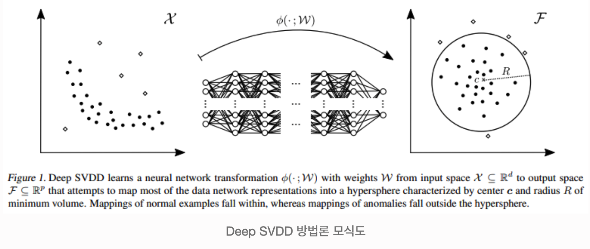

### Unsupervised Anomaly Detection

- 라벨링이 필요 없다.

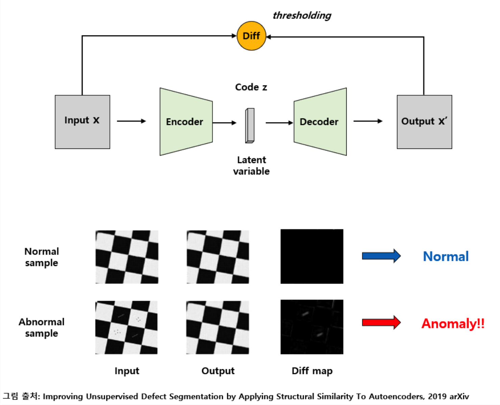

## 이상 행위 탐지

### 스켈레톤(Skeleton) + 오토인코더를 이용한 이상 행위 탐지

[Learning Regularity in Skeleton Trajectories for Anomaly Detection in Videos](https://arxiv.org/abs/1903.03295)

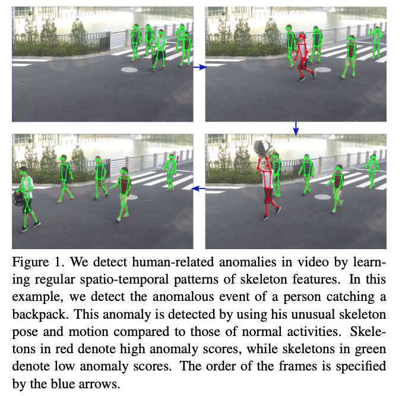

* By learning regular spatio-temporal patterns of skeleton features.
* Skeletal movement를 두개의 sub-component로 분리: global body movement와 local body posture.

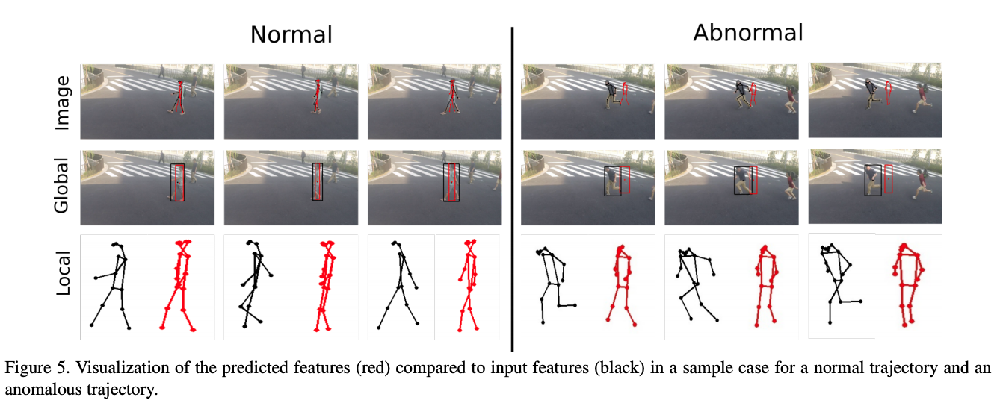

### 비디오 정보 + 오토인코더를 이용한 이상 행위 탐지

[Motion-Aware Feature for Improved Video Anomaly Detection](https://arxiv.org/abs/1907.10211)

- 모션 정보는 비디오에서 이상 행위를 탐지하기 위한 핵심이기 때문에 모션 인식 기능 (motion-aware feature)를 학습하기 위해  a temporal augmented network 제안.
- **Attention block**을 사용해서 Multiple Instance Learning (MIL) ranking model에 통합

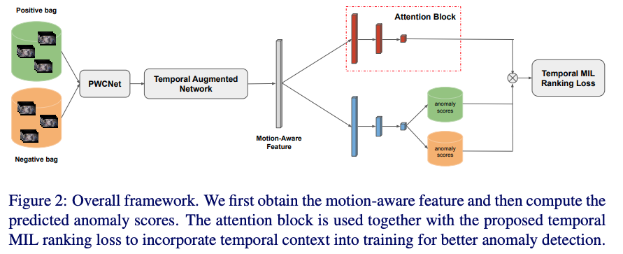

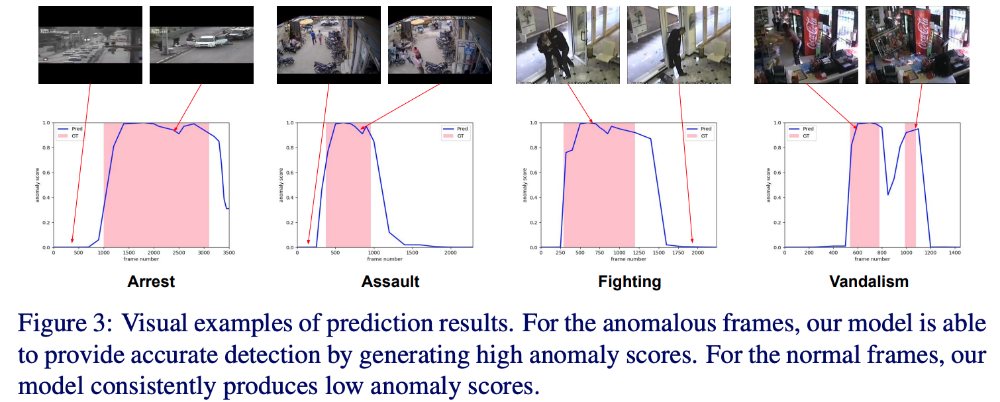

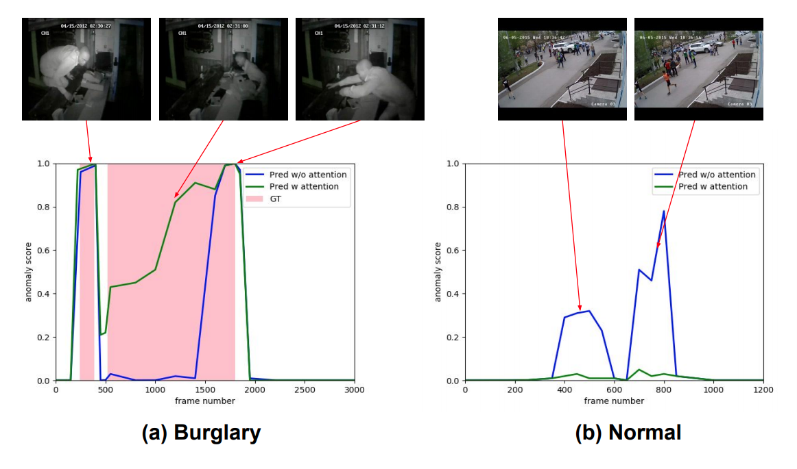

### 종합 정보(객체 탐지 + 오토인코더 + time-stamp 등)를 이용한 이상 탐지

[Challenges in Time-Stamp Aware Anomaly Detection in Traffic Videos](https://arxiv.org/abs/1906.04574)

- 교통 상황에서 Time-stamp를 인식하여 이상 상황을 탐지하는 것은 지능형 교통 시스템에서 필수적인 작업
- 비디오에서 이상 탐지는 비정상 이벤트 발생이 드물고, 다른 유형의 이상 동작이 일관되지 않고 정상 및 비정상 시나리오에 대해 사용 가능한 데이터가 매우 불균형하기 때문에 까다로운 문제
- 교통 상황에서 비정상 상황은 시간, 장소 및 환경에 따라 달라질 수 있다
  - 도로에서 자동차를 운전하는 것은 정상이지만, 고속도로에서 정체된 자동차는 이상
  - 주차장에서 움직이지 않는 자동차는 정상행동
  - 신호등 근처에서 정차된 차량은 신호가 빨간색 일 때는 정상이지만 녹색 일 때는 비정상

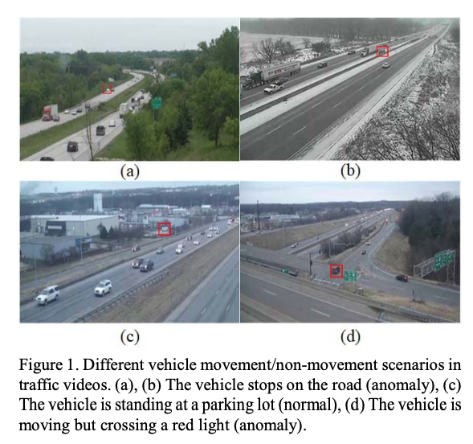

- **적절한 특징 추출, 정상 교통 상황 정의, 정상 및 비정상 데이터의 클래스 불균형 분포 처리, 비정상 동작의 변화 해결, 비정상적인 이벤트의 발생 감소, 환경 변화, 카메라 움직임** 등이 앞으로 해결해야하는 과제

  

- 논문에서는 이상 상황을 탐지하기 위해 비디오의 모션 패턴을 학습하는 3단계의 파이프라인을 제안

  - 움직임이 없는 객체를 식별하기 위해 최근 프레임으로부터 배경 추출

    - 배경 이미지는 프레임 내에서 정상 및 비정상 동작을 localization 하는데 사용됨

  - 추정된 배경에서 관심 대상을 검출

    - 관심 대상: 차량 및 신호등이 포함될 수 있음 $\rightarrow$ 종합적인 상황 인식을 위해서

  - time-stamp aware anomaly detection 알고리즘에 기초하여 교통 상황에서의 이상 탐지를 수행

    

    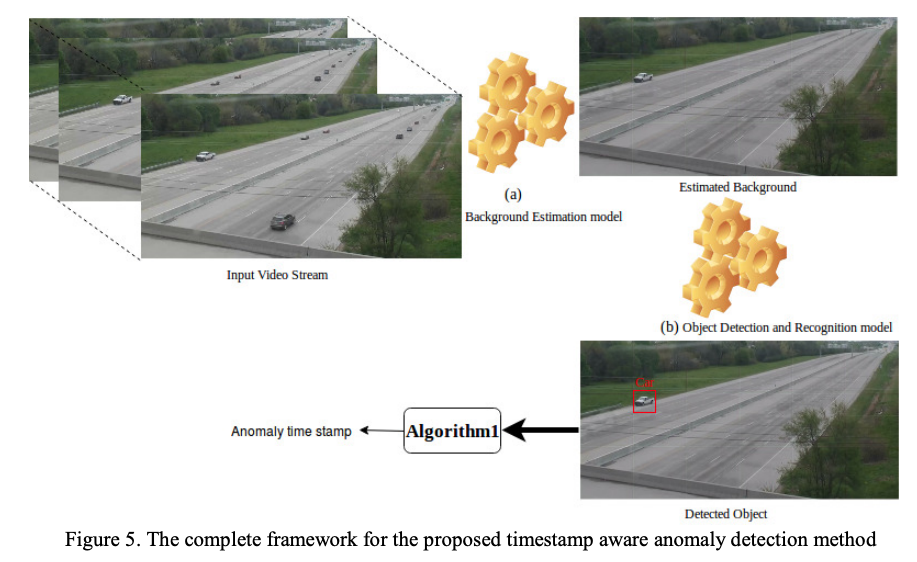

    

    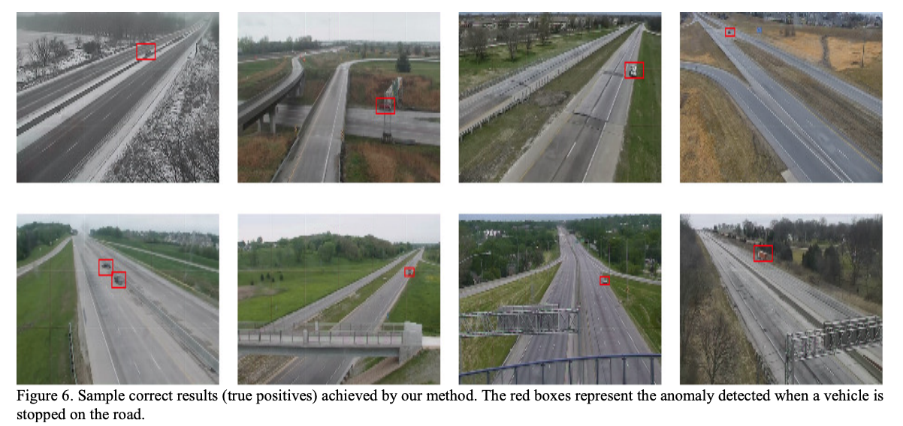

## Abstract

-  Video sruveillance에서 anomaly detection은 **가능한 이벤트가 많기 때문에** 어렵다. 
-  이 논문에서는  **common object appearances** (e.g. pedestrian, background, tree, etc.) 와 **그것과 관련된 motions** 사의 관련성을 학습함으로써 해결했다.
- 하나의 encoder를 공유하는 reconstruction network와 image translation 모델의 조합을 제안
  - **a reconstruction network** :  비디오 프레임에서 가장 중요한 structure 
  - **an image translation model**  : 그 structures와 관련된  motion template
- 학습 단계에서는  **정상적인 이벤트 비디오만**  사용했고 **unknown input**의 frame-level score를 추정할 수 있다.

## Proposed Method

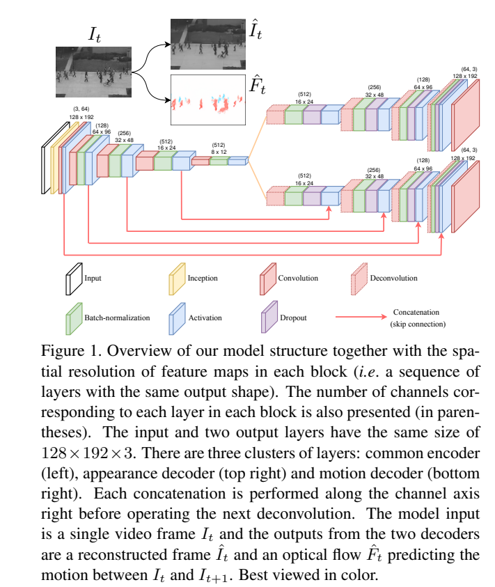

- **Conv-AE**
  - 정상적인 이벤트에서의 common appearance spatial structure.
- **Motion Decoder**
  - 입력 패턴과  그것에 해당되는 모션(opticalflow로 표현)사이의  관계를 결정

- **The skip connections in U-Net.**
  - Motion Decoder :  **low-level features** (e.g. edge, image patch) 를 유지 하기 위해

### Inception module

- 모델이 적절한 convolutional operation을 선택하기 위해.
- max pooling 사용하지 않음
  - 입력 영상이 feature map의 집합이 아니라 regular video frame이기 때문. 
- filter sizes: 1 × 1, 3 × 3, 5 × 5, 7 × 7

### Appearance convolutional autoencoder

-  정상 이벤트에서 common appearance template를 학습함으로써 이상 객체 감지 

- **Encoder**

  - convolution, <u>batch-normalization (BatchNorm)</u> , <u>leakyReLU activation</u> 

  - The first block (right after the Inception module)은  BatchNorm 사용하지 않음

  - 해상도를 줄이기 위해 pooling layer를 사용하는 것 대신에 strided convolution 사용

    

- Decoder

  -  ReLU 다음에  dropout layer (with pdrop = 0.3) 적용

- Loss

  - input image $I$ 와  reconstruction $\hat{I}$ 사이의 $l_2$ distance  : 
    
  - 
    $$
    \mathcal{L}_{\text{int}}(I, \hat{I}) = ||I-\hat{I}||^2_2 \qquad \qquad \qquad  \qquad \qquad (1)
    $$
  
  
  
- $l_2$ loss 만 사용하면 output에 blur가 되는 단점이 있어 input이미지의 gradient loss 추가 :
    
    
    $$
    \mathcal{L}_{\text{grad}} (I, \hat{I}) = sum_{d \in \{x,y\}} \left| \left| |g_d(I)| - |g_d(\hat{I})| \right| \right|_1 \qquad  (2)
    $$
    

  

$$
\mathcal{L}_{\text{appe}} (I, \hat{I}) = \mathcal{L}_{\text{int}} (I, \hat{I}) + \mathcal{L}_{\text{grad}} (I, \hat{I}) \qquad \qquad\ \qquad (3)
$$

### Motion prediction U-Net

- ground truth로 optical flow([retrained FlowNet2) 사용
- the skip connection 사용

- Loss
  - $l_1$ distance

    

$$
\mathcal{L}_{\text{flow}}(F_t, \hat{F}_t) = ||F_t-\hat{F}_t||_1 \qquad \qquad \qquad \qquad  \qquad \qquad  \qquad \qquad (4)
$$

$F_t$ : the ground truth optical flow estimated from two consecutive frames $I_t$ and $I_{t+1}$ 

$\hat{F}_t$ : the output of our U-Net given $I_t$   

###  Additional motion-related objective function

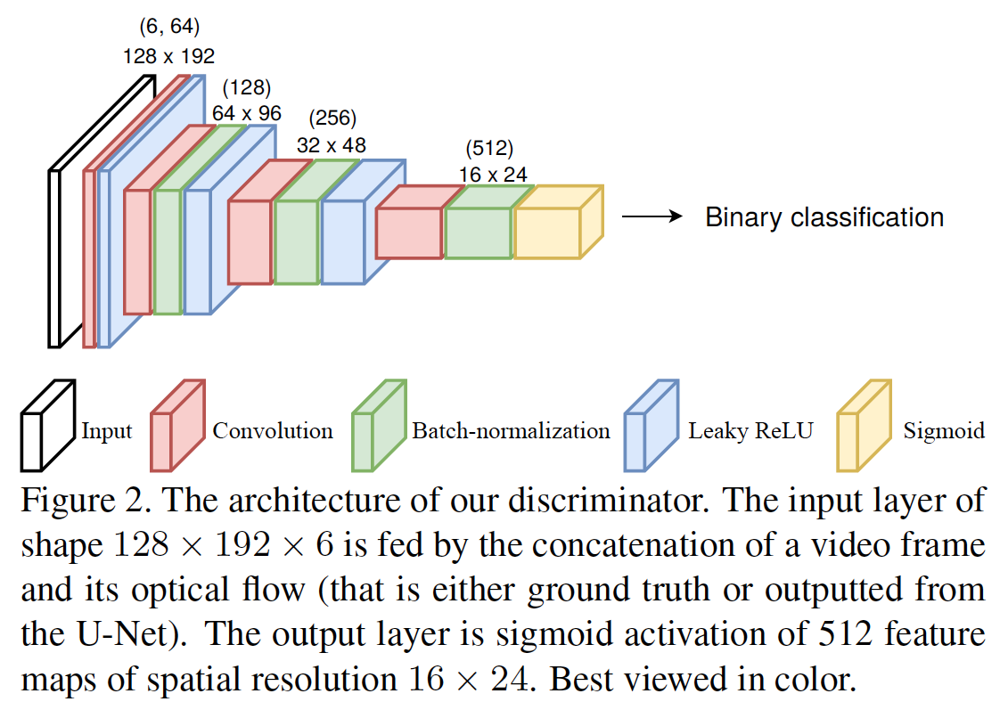

- 예측된 optical flow 기본 분포가 groud truth에 더 가까워지도록 distance-based loss $L_\text{flow}$ 외에 추가적으로 GAN Loss 적용

$I$ :  입력 비디오

 $F$ : FlowNet2로 얻은 입력 비디오의 optical flow

 $\mathcal{G}$ : generator. 제안된 네트워크

 $\hat{I}$ : a reconstructed frame 

 $\hat{F}$ : a predicted optical flow

$\mathcal{D}$ : discriminator 

$$
\mathcal{L}_\mathcal{D}(I,F, \hat{F}) = { 1 \over 2} \sum_{x,y,c} -log\ \mathcal{D}(I,F)_{x,y,c} + { 1 \over 2} \sum_{x,y,c} -log\ [1-\mathcal{D}(I,\hat{F})_{x,yc}] \qquad \qquad \qquad (5)
$$

$$
\mathcal{L}_{\mathcal{G}} (I,\hat{I},F,\hat{F}) = \lambda_{\mathcal{G}} \sum_{x,y,c} -log\ \mathcal{D}(I, \hat{F})_{x,y,c} \qquad \qquad \qquad \qquad \qquad \qquad \qquad \qquad \\
+ \lambda_a \mathcal{L}_{\text{appe}}(I, \hat{I}) + \lambda_f \mathcal{L}_\text{flow}(F,\hat{F}) \qquad \qquad \qquad(6)
$$

$\lambda_\mathcal{G}$ : 0.25

$\lambda_a$ : 1

$\lambda_f$ : 2

###  Anomaly detection

 CNN 방법에서 사용하는 2가지 common score

- $L_p$ distance
- Peak Signal To Noise Ratio (PSNR)

$$
\begin{cases}
S_I(P) = {1 \over {|P|}} \sum_{i,j \in P} (I_{i,j} - \hat{I}_{i,j})^2   \\
S_F(p) = {1 \over {|P|}} \sum_{i,j \in P} (F_{i,j} - \hat{F}_{i,j})^2 
\end{cases} \qquad \qquad \qquad (7)
$$
$P$ : 이미지 패치 (16x16)

$|P|$ : 이미지 패치의 픽셀 수

$$
S= log[w_FS_F(\tilde{P})] + \lambda_S log[w_IS_I(\tilde{P})] \qquad \qquad \qquad (8)
$$
$w_F$ , $w_I$ : the weights calculated according to the training data 

$$
\begin{cases}
w_F = \left[ {1 \over n} \sum_{i=1} ^n S_{F_i}(\tilde{P}_i) \right]^{-1}   \\
w_I = \left[ {1 \over n} \sum_{i=1} ^n S_{I_i}(\tilde{P}_i) \right]^{-1} 
\end{cases} \qquad \qquad \qquad (10)
$$

$\lambda_S$ :  control the contribution of partial scores to the summation (0.2)

$\tilde{P}$ :  the patch providing the highest value of $S_F$ in the considering frame

$$
\tilde{P} \leftarrow \underset{\text{P slides on frame}}{\text{argmax}} S_F(P) \qquad \qquad \qquad (9)
$$

a normalization on frame-level scores in each evaluated video

$$
\tilde{S}_t = {S_t \over \text{max}(S_1..m)} \qquad \qquad \qquad (11)
$$
$t$ : the frame index in a video containing $m$ frames

## Experiment

- CUHK Avenue
- UCSD Ped2
- Subway Entrance Gate and Exit Gate
- Traffic-Belleview와 Traffic-Train

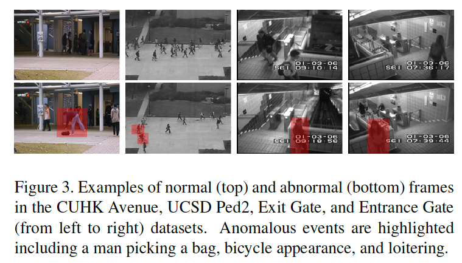

- Ground truth optical flow estimator
  - FylingTihing3D와 ChairsSDHom 데이터 셋으로 학습시킨  FlowNet2

### CUHK Avenue and UCSD Ped2

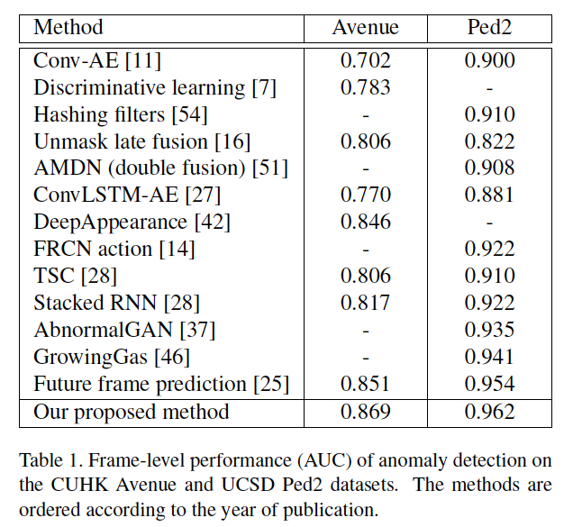

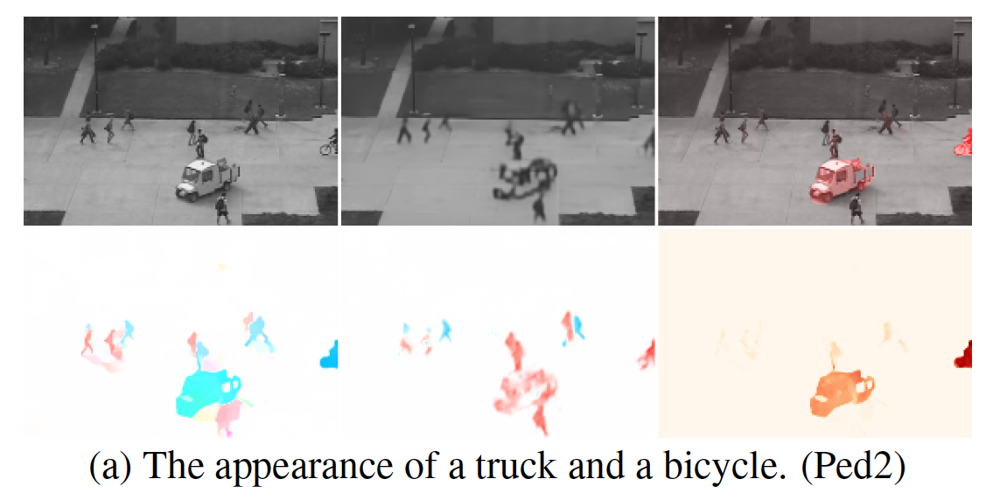

- 트럭은 처음 보는 객체이기 때문에 보행자의 패턴으로써 reconstruct 되었다.

- 그래서 트럭의 predicted motion은 ground truth와 완전히 다르다.

- 맨 오른쪽 자전거도 마찬가다.

  

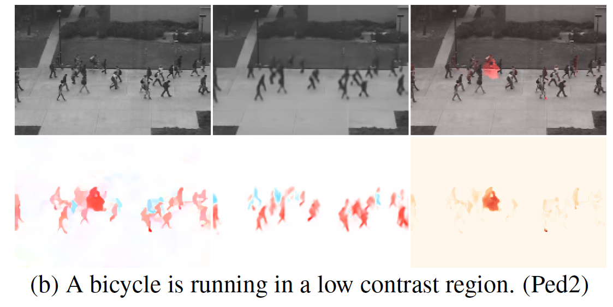

- 자전거는 처음 보는 객체이기 때문에 보행자와 배경과 비슷한 밝기로 표시 되었다.

  
  
  
  
  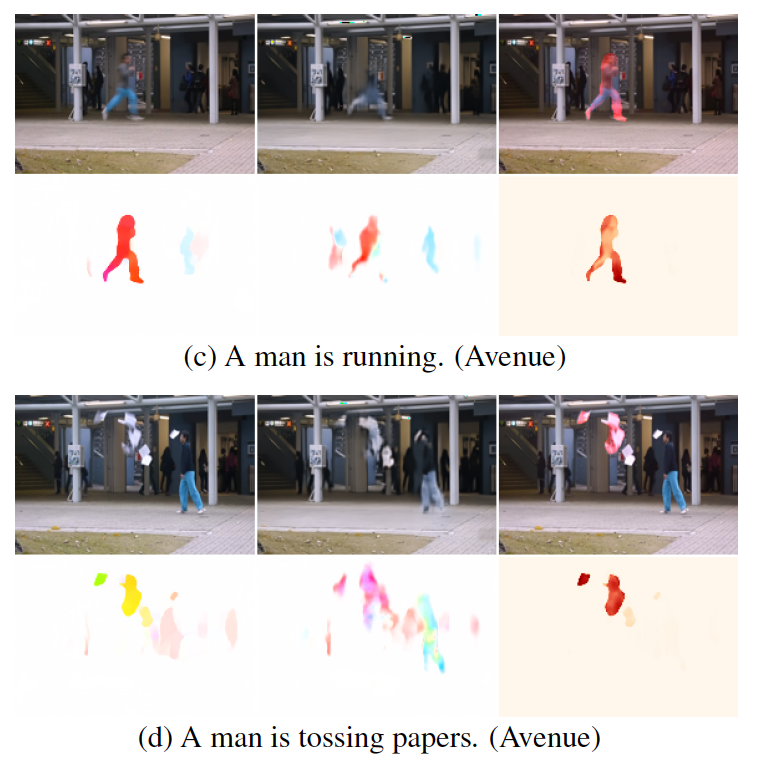

- 모델은 훈련 데이터에서 관찰된 것 처럼 느린 이동속도와 다른 모션 방향을 예상했다.

  

### Subway Entrance and Exit gates

- 비정상적인 이벤트
  - 잘못된 방향 (탑승자가 출입구를 통해서 나가는 경우)
  - 지불을 하지 않는 경우
  - 배회 (loitering)
  - 불규칙한 상호작용
    - 다른 사람을 피하기 위해 어색하게 걷는 사람
    - 갑자기 걷는 속도를 변경하는 경우

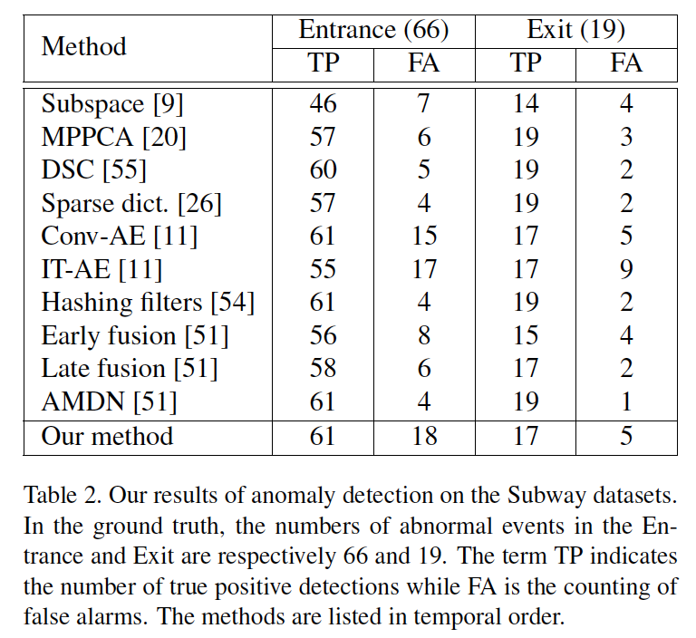

- FA(false alarm)이 다른 방법에 비해 높다. 
  - 테스트 세트에서 정상으로 표시된 일부 이벤트가 다른 상황에서는 이상으로 간주될 수 있기 때문.

#### false alarm과 missed anomaly detection의 visualization

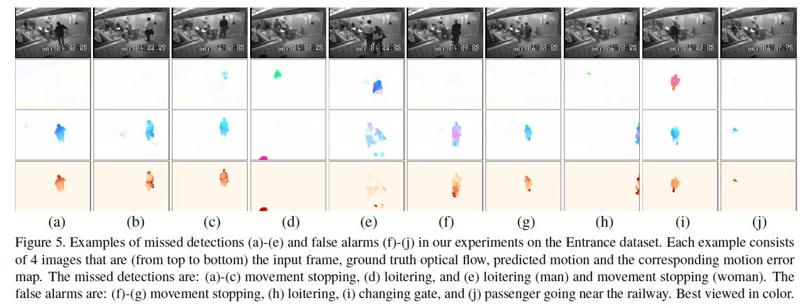

- movement stopping과 loitering에 대한 normality decision이 불안정 하다.
  -  (a)-(e)는 miss 했고 (f)-(h)는 잘 못 detect 했다.

원인

- anomaly score가 smoothly 혹은 slowly 하게 변할 때  maxmium localization을 사용하는 것은 적절하지 않다.
- training set에 (b)와 (e)에 있는 남자가 loitering하는 데이터가 있다. 
- (h)는 loitering하는 남자가 오른쪽 사이드에 보이지만 anomaly로 label되지 않아 ground truth annotation이 애매하다.
- (i)  에서는 모델이 남자가 left gate로 들어 갈 것으로 예상했지만 갑자기 오른쪽 문으로 바뀌었다. 이런 행동은 훈련 데이터에 나타나지 않아 모델은 anomalous event로 예측했다.
- (j)는 motion stream 이 위치에있는 대부분의 사람들이 훈련 데이터에서 좌측으로 이동하기 때문에 승객이 기차에 갈 것을 예상했다. 

### Traffic-Belleview and Traffic-Train

Traffic-Belleview

- 좌우로 움직이는 차를 이상으로 간주

Traffic-Traing

- **camera jitter에 따라 lighting condition이 심하게 변한다.**
- 사람의 움직임을 이상으로 간주

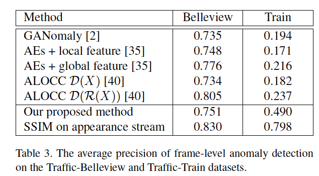

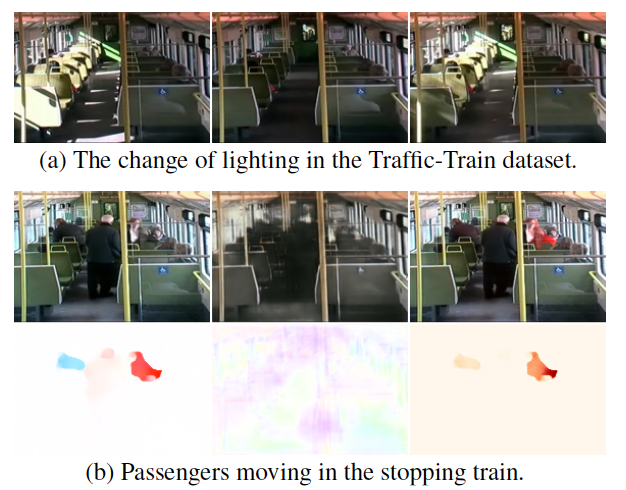

- 움직임이 매우 nosy 하고 가운데 승객을 error map에서는 놓쳤다. 

- 카메라 지터의 영향을 줄이기 위한 시도로, motion의 support 없는 다른 프레임 레벨 점수를 추정했다. 

- 구체적으로는 Structure Similarity Idex(SSIM)[50]를 사용하여 입력 프레임과  appearance stream이 만드는 reconstruction의 유사성을 계산했다. MSE나 PSNR과 같은 다른 일반적인 측정과 비교하여 SSIM은 픽셀별 비교가 적절하지 않은 지터 영상에서 잘 작동할 수 있다.

- 표 3은 이러한 변경이 특히 열차 데이터 세트를 통해 이상 징후 감지 결과를 개선했음을 보여준다. ROC 및 PR 곡선, 일부 형상 지도의 시각화 및 각 단일 스트림의 평가 결과를 포함한 자세한 내용은 보충 자료에서 제공된다.

  

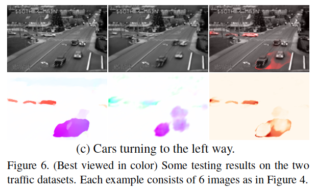

- optical flow estimator의 영향은 두개의 차가 big blob로 결합된 Figure 6(c)에 잘 설명되어 있다. 이 잘못된 추정으로 인해 다른 방향으로 달리는 3대의 차는 정확하게 찾아 냈음에도 불구하고 error map에 큰 영향을 미쳤다.
  - 다른 optical flow 를 선택하거나 FlowNet2를 좀 더 적절한 데이터 셋으로 pretrain 시킴으로써 개선할 수 있을 것이다.

